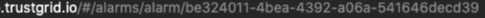

{}
A channel defines one or more method of delivering alert notifications to external systems.  
{}

### Notification Delivery Channels

- Email - One or more email address (comma separated) that will receive messages from alerts@trustgrid.io

- PagerDuty - Trustgrid will generate an incident via the PagerDuty API if provided a valid API routing key.

- OpsGenie - Trustgrid will generate an incident via the OpsGenie API if provided a valid API key with read and create and update permissions.

 For both PagerDuty and OpsGenie the integration will automatically resolve issues if an [event]() occurs that negates the initial triggering event. For example, if an [event]() is triggered by a Node Disconnect and the [node]() reconnects, the Node Connect [event]() will resolve the incident via the API. 

- Slack - Trustgrid can post the [event]() data to a configured channel via a webhook.

- Microsoft Teams - Trustgrid can post [event]() data to a configure Teams channel via an incoming webhook

 Only a single Slack or Teams channel can be targeted by a Trustgrid channel. However, you can create multiple Trustgrid channels if you wish to post the [event]() data to more than one Slack/Teams channel. 

### Example Event Data

The [event]() data is delivered in JSON, as shown below, which depending on the integration can allow for additional parsing.


{
"nodeName": "edge1",
"expires": 1604801325,
"level": "INFO",
"eventType": "Node Disconnect",
"source": "EKG",
"message": "Node disconnected",
"type": "Alert",
"orgId": "8e1c2c05-2c86-4b1b-a0cc-############",
"GS1PK": "Org#8e1c2c05-2c86-4b1b-a0cc-############",
"\_ct": {},
"uid": "1jwV1R2R6itQUjPza9yqTE8a8zu",
"GS1SK": "Alert#1jwV1R2R6itQUjPza9yqTE8a8zu",
"\_md": {},
"domain": "example.trustgrid.io",
"SK": "Alert#Node Disconnect",
"\_tp": "Alert",
"PK": "Node#0895b104-5434-447b-8577-############",
"state": "UNKNOWN",
"nodeId": "0895b104-5434-447b-8577-############",
"timestamp": 1604714923,
"channelID": "bc47ca84-1d04-454b-bedc-a55d1a917c0e",
"notes": [
"Text from Description Field"
],
"alarmIDs": [
"be324011-4bea-4392-a06a-541646decd39"
]
}


### Event Data Descriptions



This is the name of the [node]() that the [event]() relates to.



This is the Unix epoch time when this [event]() will expire and automatically resolve.



This is the alert severity.



Matches to the [event types]().



This is the Unix epoch time when the [event]() was first triggered.



This is the unique identifier of the Trustgrid channel that was used to deliver this message. You can match this to the URL of the channel in the portal.




Since a channel can be used by more than one [alarm filter]() this will return an array of 1 or more alarm filters that matched the [event]() and used this above channel. You can match this to the URL of the [alarm filters]() in the portal.


This can be handy for determining which filter or filters' criteria matched the [event]() and sent the notification through this channel.
