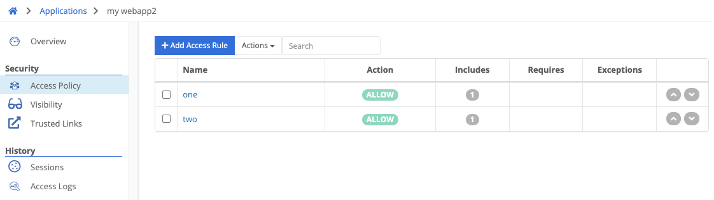

{}
An Access Policy is comprised of several rules that determine whether a user is permitted to access a ZTNA application. If no rule matches a user's access attempt, the attempt will be denied.
{}

Each rule has three types of criteria:



criteria in this section are logically OR'd together. For a rule to apply to an access attempt, at least one of the include criteria must match.


criteria in this section are logically NOT'd. If any exception criterion matches, the rule will not apply to the access attempt.


criteria in this section are logically AND'd. ALL of the require criteria must match for the rule to apply to the access attempt.



Rules also have an action:

- Allow - if the rule matches, allow access
- Block - if the rule matches, block access

Rules are evaluated in the order they are listed in the policy. Rules may be moved higher or lower in the list by clicking the up or down arrows next to the rule.

### Criteria



a list of email addresses, comma separated. Eg, "user1@company.com, user2@company.com"


the user's country, determined by their IP address


a required email suffix, like "@company.com"


this rule always matches


a list of [groups]() that the user must be a member of


a list of IP ranges either in CIDR notation or a single IP address, comma separated. Eg, "10.10.44, 10.10.8.0/24"



