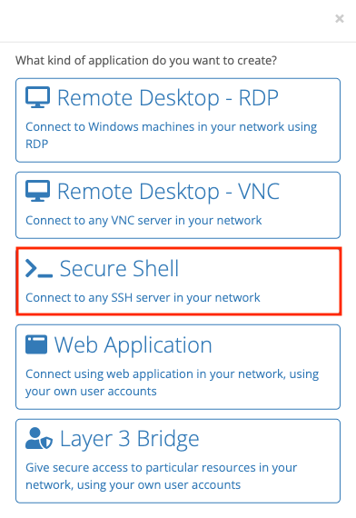

{}
A SSH app is a ZTNA application that allows remote access to internal SSH servers. SSH servers can be hosted internally but exposed to authorized users.
{}

## General



app name


app description


the application's icon (optional) to show in the application dashboard



## Connectivity

- Connectivity type:
  - local to gateway - the application is hosted on the same network as the gateway
  - remote node - the application is hosted on an edge node's network
  - virtual network - the application is accessible over the Trustgrid virtual network from the ZTNA gateway
- ZTNA Gateway - the ZTNA gateway node that will be used to connect to the application
- Destination Node - only available if connectivity type is Remote Node. The edge node with access to the application
- VRF - only available if connectivity type is Remote Node. The VRF used to connect to the application.

- Internal server hostname or IP - the internal hostname or IP address of the SSH server and port number

- Virtual server URL - the internal URL of the application
- Virtual Network - only available if connectivity type is Virtual Network. The virtual network that will be used to connect to the application
- Client Virtual IP - only available if connectivity type is Virtual Network. The virtual IP address that will be used to connect to the application

## Security

- Identity Provider - the [Identity Provider](https://portal.dev.trustgrid.io/#/identity-providers) to authenticate users

1. Click `Add Application`

2. Click the `Secure Shell` option

3. Fill out all details in the sheet provided, then click `Save` when satisfied with the information entered

