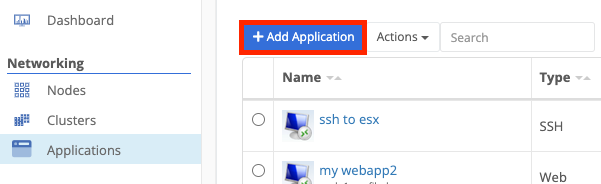

{}
A Web App is a ZTNA application that allows remote access to internal web applications. Services such as [Jenkins](https://www.jenkins.io/) or [JIRA](https://www.atlassian.com/software/jira) can be hosted internally but exposed to authorized users.
{}

#### General



app name


app description


hostname of the internal web application


the public URL users will use to access the application


the application's icon (optional) to show in the application dashboard



#### Connectivity

- Connectivity type:
  - local to gateway - the application is hosted on the same network as the gateway
  - remote node - the application is hosted on an edge node's network
  - virtual network - the application is accessible over the Trustgrid virtual network from the ZTNA gateway
- ZTNA Gateway - the ZTNA gateway node that will be used to connect to the application
- Destination Node - only available if connectivity type is Remote Node. The edge node with access to the application
- VRF - only available if connectivity type is Remote Node. The VRF used to connect to the application.
- Virtual server URL - the internal URL of the application
- Virtual Network - only available if connectivity type is Virtual Network. The virtual network that will be used to connect to the application
- Client Virtual IP - only available if connectivity type is Virtual Network. The virtual IP address that will be used to connect to the application
- TLS verification
  - none - no TLS verification is performed
  - custom CA - Trustgrid will validate the application's certificate against the provided CA
  - default key store - Trustgrid will validate the application's certificate against the default key store
- TLS Custom CA - only available if using Custom CA TLS verification. The CA certificate used to validate the application's certificate

#### Security

- Identity Provider - the [Identity Provider](https://portal.dev.trustgrid.io/#/identity-providers) to authenticate users
- User session duration - How long a user's session will last before they are required to re-authenticate
- Trust Mode:
  - Discovery - all URLs accessed through the application will be permitted and listed in the [Trusted Links]() section
  - Zero Trust - only URLs explicitly trusted by the application will be permitted

1. Click `Add Application`

2. Click the `Web Application` option

3. Fill out all details in the sheet provided, then click `Save` when satisfied with the information entered

