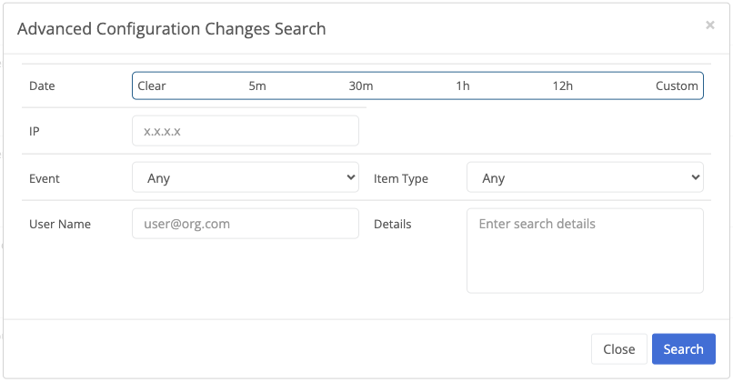

{}
Trustgrid records information about changes users make to all configuration. This can be helpful when troubleshooting recent changes.
{}

Changes can be viewed for a specific node and for the entire organization. To view changes for a specific node, navigate to a node and select `Changes` under the `History` section. To view changes for the entire organization, navigate to `Operations`->`Changes`.

The following information is shown for each change:


When the change was made
The IP address from which the change originated
The type of change (delete/create/change/action). Note that for some entities where the entire entity is re-sent to the API, a change may show `create` instead of `change`.
Information about the change. Typically will include the item's ID and a brief summary of the changes made.
The user who made the change
The type of item changed


Viewing configuration changes requires `audits::read:config` permissions.

Configuration changes are stored for 90 days.

The last 90 days' worth of changes can be downloaded as a CSV by clicking the link at the bottom of the page.

## Searching for Changes

The `Advanced Search` button allows you to search for changes by date, user, IP address, and event type. The search is case-sensitive.
