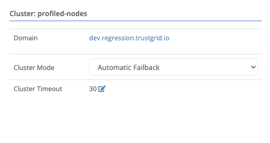
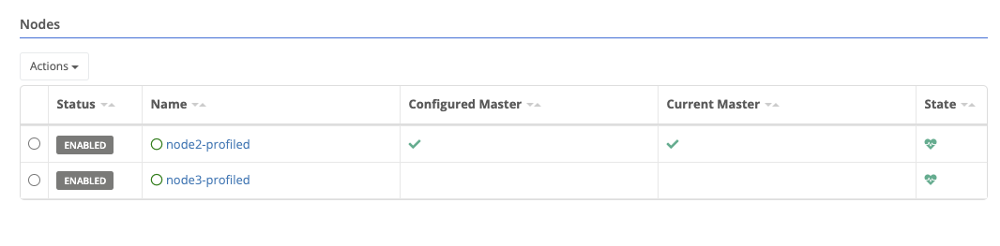
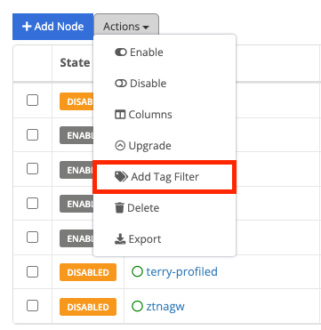
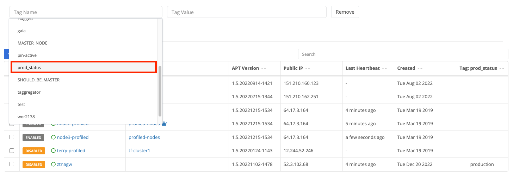
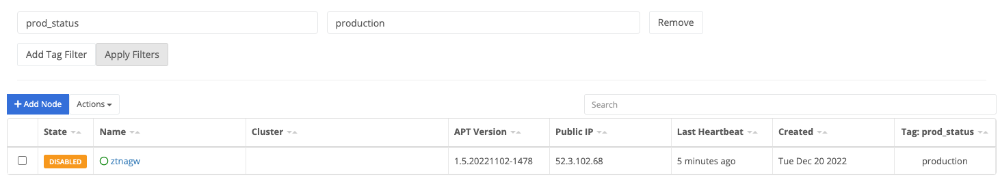

{}
A cluster is a pair of [nodes]() that share configuration and an active/standby relationship, providing automated high-availability (HA) connectivity.
{}

A cluster is a pair of [nodes]() at a single site that share some configurations and provide automatic failover. An additional IP address is assigned as a Cluster Virtual IP address that can move between the [nodes]() if failover occurs.

Certain settings such as network services and VPN settings can be configured for the cluster and these settings will override the individual [node's]() configuration.

Formerly the active member was referred to as the “master.” We are in the process moving to the terms active and standby. This documentation will use those terms but elements in the UI may retain the _master_ term.

## Requirements

- Nodes in the cluster must be using the same model of appliances
- Nodes must be able to create direct TCP connections with each other
- Nodes should be at the same site or have high-bandwidth, high-reliability, low-latency connections between the devices

## Active Member Determination

The active member of a cluster is determined by the following factors:

- Cluster heartbeat communication
- Cluster mode
- Configured master
- Cluster member health

### Cluster Heartbeat Communication

Cluster members utilize a direct TCP connection to each other to determine if their partner is online and share their health status. Each node will listen on a configured heartbeat IP and port, while at the same time connecting to their partner’s configured heartbeat IP and port.

Local ACLs allow only the partner cluster member to connect to the listening port.

Heartbeat communication is configured on each node's [cluster]() page.

### Cluster Mode

A cluster can be configured in two different modes to determine what happens when a failed member returns to healthy status:

- Automatic Failback (Default) - In this mode the member set as the Configured Master (see below) will maintain the active/master role as long as it is online and healthy.
- Manual Failback - In this mode, the active/master role only moves if either the current holder fails or the configured master is changed

Consider a cluster with members named Node1, the configured master, and Node2.

| Event                           | Automatic Failback - Active Member | Manual Failback - Active Member |
| ------------------------------- | ---------------------------------- | ------------------------------- |
| Initial State                   | Node1                              | Node1                           |
| Node1 unhealthy/offline         | Node2                              | Node2                           |
| Node1 returns to healthy/online | Node1                              | Node2                           |

### Configured Master

Each cluster will have one configured or preferred active member. This is reflected in the overview section.

A node may be designated as the preferred active member by selecting the node and clicking the "Set as Master" action

The `Configured Master` field will change immediately, but the `Current Master` may take a minute to reflect the change as the nodes process the change and notify the control plane.

## Cluster Member Health

There may be situations where both cluster members are online and can communicate with each other, but external conditions exist that make a node unsuitable to hold the active role. The Trustgrid node service monitors for such conditions and will make a node as unhealthy if one occurs. The node will release the active role and its standby member will take over if it is online and healthy.

When the condition clears the node will declare itself healthy and inform its partner member. Depending on the cluster mode it may reclaim the active role.

### Cluster Member Health Conditions

- Loss of [cluster heartbeat]() communication - If a node cannot communicate with its partner nodes on the configured IP and port it will declare that partner node unhealthy and claim the active role if it has not already.

- Interface Link (Up/Down) State - Any interface configured with an IP address in the Trustgrid is monitored for a successful connection to another network device

  - Example: In a two-interface setup it would be possible for the LAN interface to become unplugged but the node to remain online from the cloud and data plane perspective. However, the lack of LAN connectivity would prevent the node from delivering any Trustgrid services to that network
  - Note: If only a single node has an interface configured, such as an alternate MPLS path, Trustgrid support can configure it to be ignored for triggering.

- Upstream Internet Issues - If a Trustgrid node is unable to build connections to both the Trustgrid control plane AND data plane connections to its gateways the node will be marked as unhealthy. This does require all the connections to be failing before it is triggered

  - Example: If an upstream internet provider or device experiences failure the node will not be able to provide any services.

- WAN Interface DHCP failure - If the WAN interface is configured to use DHCP and it does not receive a DHCP lease it will mark itself unhealthy.

- Layer 4 (L4 Proxy) Service Health Check - TCP L4 Proxy Services can be configured to regularly perform health checks to confirm a successful connection can be made. If these checks fail 5 times in a row the service will mark the cluster member as unhealthy.
  - Example: If each cluster member’s LAN interface is connected to a different switch and one switch fails that member will be unable to connect to any IP:ports dependent on that path.  
    Use caution before configuring multiple services with health checks. This could create a situation where both nodes declare themselves unhealthy because a single service is failing if the server providing the service goes offline. 

## Cluster Member Shared Configuration

Cluster members can share the configuration for the following services:

- Networking
  - Interfaces
    - Interface routes
    - Cluster VIP (supported in on-premise, traditional network environment)
    - AWS/Azure/GCP route table entries
  - VPN
  - Tunnels
  - VRFs
  - ZTNA gateway endpoints
  - Layer 4 services and connectors
- Compute
  - Container and command definitions
  - Resource limits

## Tags

[Tags]() are visible at the bottom of the overview page for the resource.

### Modifying Tags

To add a tag:

1. Click `Add Tag`.

1. A new row will appear at the bottom of the tags table. There will be a list of existing tag names for your organization. You can filter the list by typing in the field. You can either select an existing tag name, or create a new one by typing it out in full and then selecting `New selection: tagName`.

  

1. Next move to the values field. As with the name, existing values will be listed. To enter a new value type it in completely.

1. Click `Save`

Tag rows can be edited in-place. Change the name or value, then click `Save`.

To remove a tag, click the red X next to the tag name, then click `Save`.

### Applying a Tag Filter to the Clusters Table

The clusters table can also be filtered to only show clusters with a specific tag name:value.

1. On the clusters table click `Actions` and select `Add Tag Filter` from the drop-down menu.

1. After clicking `Add Tag Filter`, select the tag-name field and you will see a list of tag-names available. Select the desired tag.

You can also start typing to filter what tag names are shown.

3. Select the tag value field and you will see a list of available values. Select the desired value.

4. (Optional) Click `Add Tag Filter` to include an additional filter. Note that the two filters will be applied using AND only clusters with both tag name:value combinations matching will be shown.

5. Click `Apply Tag Filter` and the table will only show matching clusters.

