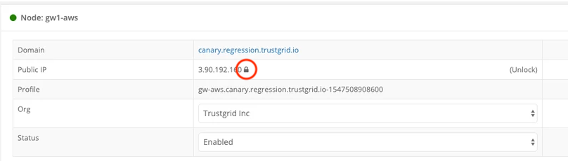

{}
This security feature allows restricting node functionality to the current public IP address. If the public IP changes the data plane connectivity will cease to function and no data plane traffic will pass. It is the equivalent to disabling a node in the trustgrid portal. This feature should not be used on networks where the Public IP is controlled via DHCP. It should only be used where the public address is statically assigned to the node and is not expected to change. 
{}

###### Process to Restrict
- Click `Lock` Button next to Public IP  (Do not enable if using DHCP. Static addresses only)

- Public IP should now show padlock icon as locked as shown below

- Click `Unlock` to remove the restriction at any point.

###### Alerts:
Once locked changing the Public IP of the node will result in an alert being generated as seen belo. At this point no data plane traffic will be allowed.

