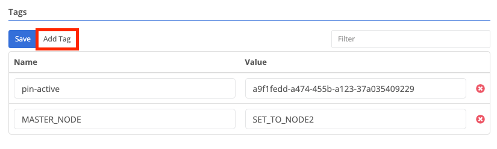
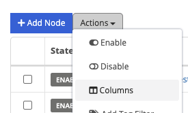
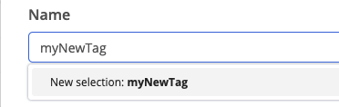

{}
A tag is a name / value pair that can be used to provide additional information about a Trustgrid resource (node, cluster, etc).
{}

Tags are useful when managing enterprise-scale deployments of nodes. Tags allow the user to identify quickly and easily a node or group of nodes with the same property. Both the name and value of the tags are set by the user. Names should provide the context and values provide the actual data. For example, to provide the address of a device you would set the Name to `address`, and the value to something like `123 Main St`.

It is a best practice for Trustgrid customers to standardize on a set of tag names and appropriate values. This increases the consistency of use across your organization. When adding tags the existing tag names and associated values will be prepopulated as options.

Some common uses of tags are:

- Supporting information (production status, contact info, hours of operation, escalation)
- On-premise/edge location information (site name, address, pin code)
- Configuration (High availability, instance type, region, disaster recovery)


Tag names and values are case-sensitive and should only consist of letters, numbers, dashes (`-`), and underscores (`_`).


# Viewing Tags

#### Viewing Cluster Tags

Cluster tags are visible at the bottom right of the Overview page for the resource.

## Viewing Node Tags

There are multiple ways to view [Node]() tags.

## Viewing Node Tags from the Node detail page

After navigating to a specific [node’s]() detail page you can view the tag by:

Opening the Tags panel from the left side navigation bar:

Open the info panel by clicking "Info" in the top right or by clicking the ` (backtick) key

## Viewing Node Tags on the Nodes Table

There are two ways to use Node tags when viewing the Nodes table.

## Adding a Tag as a Column on the Nodes Table

Adding a tag as a column on a Nodes table is good way to make valuable information visible for multiple nodes at the same time. To add the column:

1. Navigate to the Nodes table page
1. Click Actions and then select Columns from the dropdown

3. Towards the bottom you will see all the available tags in the format tag: tag-name. Select the desired tag and click save.

The column will be added and the table can now be sorted by that column. Any node that does not have that tag set will be listed as blank.

## Applying a Tag Filter to the Nodes Table

The Nodes table can also be filtered to only show nodes with a specific tag Name: value.

1. On the Nodes table click Actions and select Add Tag Filter from the drop-down menu

2. After clicking "Add Tag Filter", select the Tag Name field and you will see a list of Tag names available. Select the desired tag.

You can also start typing to filter what tag names are shown.

3. Select the Tag Value field and you will see a list of available values. Select the desired value.

4. (Optional) Click Add Tag Filter to include an additional filter. Note that the two filters will be applied using AND so only nodes with both tag name: value combinations matching will be shown.

5. Click Apply Tag Filter and the table will only show matching Nodes.

## Add, Change, or Delete Tags

## Add a Tag

1. On the Overview page of a [Cluster]() or [Domain](), or on the Tags panel of a [Node]() click “Add Tag”

2. The “Add Row” page will pop up with the Name field pre-selected. There will be a list of existing tag names for your org. You can filter the list by typing in the field. You can either select an existing tag name, or create a new one by typing it out in full and then selecting `New selection: tagName`.

3. Next move to the Values field. As with the Name existing values will be listed. To enter a new value type it in completely.

1. Click Save

## Change a Tag

This all needs to be rewritten.

include link to api

Delete a Tag

This all needs to be rewritten.

include link to api docs
