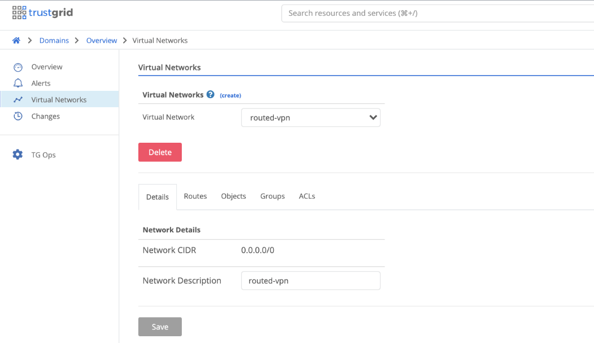
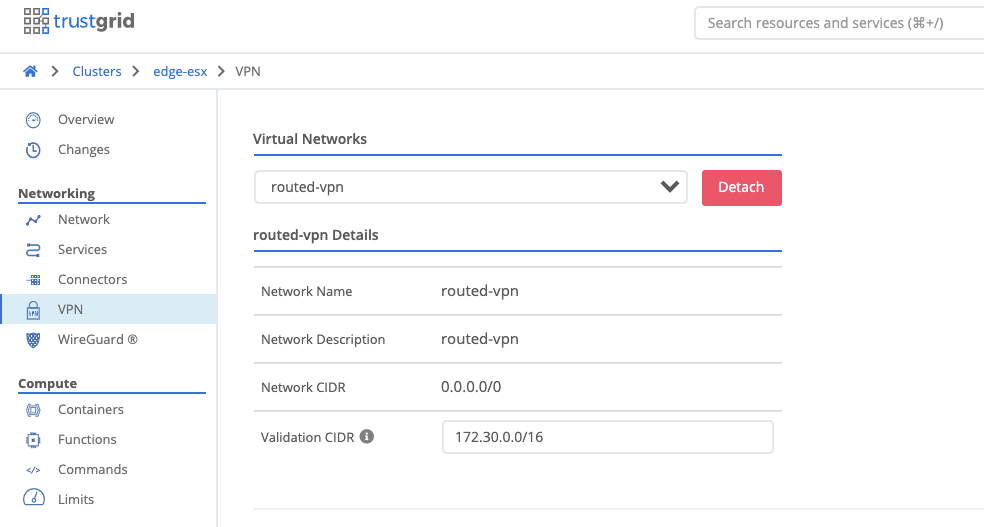
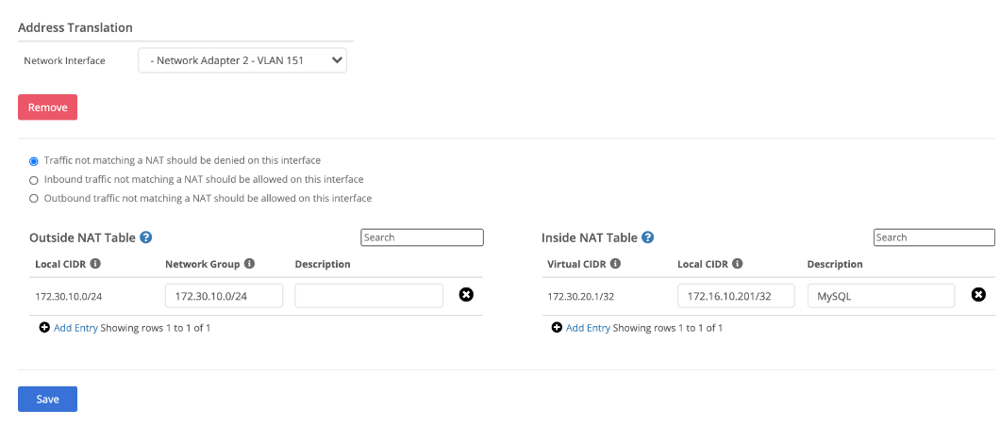

The VPN feature enables routing of IP packets by utilizing a virtual IP space that is configured on the nodes. In this configuration, the node can be used as the next hop for route destined for the virtual IP space, or the node can be used as the default gateway for a network. The virtual IP space is used as a transit network with NAT being utilized to translate IP addresses on to/from the virtual IP space on either side. It is also possible to preserve the original source and destination by having the virtual IP space be identical to the LAN network. 

The Trustgrid VPN feature provides the capability to securely route IP packets between remote networks.  In this configuration, Trustgrid nodes can operate as a distributed mesh virtual private network (VPN) that can allow applications to access remote data and services at layer 3 (L3) of the network OSI model.  This is done by defining a virtual L3 network (similar to an Amazon VPC) and then selecting how local node networks are exposed and translated into the the virtual address space.

The following steps illustrate how to configure the Trustgrid VPN feature and will need to be configured on all [nodes]()/[clusters]() that need to communicate across the virtual network.

1. Create the Virtual Network 
Under `Domains` -> `Domain` -> `Virtual Networks` create the `Virtual Network`. All gateway/edge nodes deployed and attached to this virtual network will need to be assigned a subnet out of this IP space. It is important to ensure the CIDR created is large enough to encompass all future node deployments. In this example the entire IPV4 space is being used. This IP space is only applicable to the individual virtual network therefore if there are multiple virtual networks there is no overlap or conflict in IP space allocation.

2. Create [Routes]() for the desired Virtual CIDR with the destination being either a single node or a cluster if an HA deployment. 

3. Create the appropriate ACL’s if desired for only allowing specific traffic to pass. An ACL is required for any traffic to pass as it is a zero trust model. If traffic is already filtered before reaching the Trustgrid nodes then at minimum an `Any:Any` rule will need to be created as seen below.

4. Attach Virtual Network to Node / Cluster
Select the node or cluster and under vpn attach the virtual network. Define the validation CIDR which should match the route created. NAT rules can only be created within this CIDR.

5. Select the appropriate interface to attach the virtual network to. This can be a physical interface or a virtual vlan interface and should be whichever interface clients will be using as the next hop to reach the remote networks. Configure the appropriate Inside and Outside NATs and then save the configuration. NATs explained in further detail below.

#### Inside NAT:
An inside NAT defines how a local device IP address translates into a virtual network address.  For instance, a local device may have a local IP address of 192.168.1.100, but you may want it to appear to other devices or applications on the virtual network as IP address 10.0.20.100.  Or you may want an entire block of local IP addresses to show up on the virtual network as a different block.  You can do this translation via Inside NATs.  Inside NAT's also control what local devices can participate on the virtual network.  If a local device does not have an inside NAT configured that includes its IP address, it can't access or be accessed by other devices on the network.  To add an inside NAT you must enter the following information:

1. Local CIDR - The local IP address or address block that should be mapped into the virtual network.  It should be entered in CIDR block format (eg - 192.168.100.0/24 or 192.168.100.51/32).

2. Virtual CIDR - The network IP address or addresses that the local IP addresses should be mapped to, also entered in CIDR block format.

Note that network addresses map 1x1 with local addresses, so the prefix length (the /xx number of the CIDR) should be the same in both the local and network CIDR blocks of the inside NAT entry.

#### Outside NAT:
By default, when a device on the local network of a node receives traffic from a remote device on the network, the remote device IP address will be the IP address that was entered in the local CIDR block for the remote node's inside NAT entry for the remote device.  For instance, if the remote device was mapped to network address 10.0.100.1, then its traffic on the local network will appear to come from IP address 10.0.100.1.  However due to the local network configuration, there may be some situations where it is desirable to translate remote network addresses before egressing onto the local network.  For instance on a local network of 192.168.0.0/16, a user may want the remote devices virtual network IP of 10.0.100.1 to be translated to 192.168.50.5 so that it fits better into the local network setup.  This kind of translation can be achieved by adding outside nats.  To add an outside NAT you must enter the following information:

1. Network Group - The network IP address or addresses that should be translated before egressing onto the local network.  This should be entered in CIDR block format.

2. Local CIDR - The local IP address or addresses that the network addresses should be mapped to, also entered in CIDR format.

Note there are situations where it may be desirable to make multiple remote devices masquerade as one local IP address though the use of port address translation (PAT).  This can be achieved by defining an outside nat in which the network CIDR contains a larger address space than the local CIDR.  For instance, an entry with network CIDR 10.0.1.0/24 and local CIDR 192.168.100.10 would make all remote devices with network IP addresses in  10.0.1.0/24 appear as IP address 192.168.100.10 on the local network.

