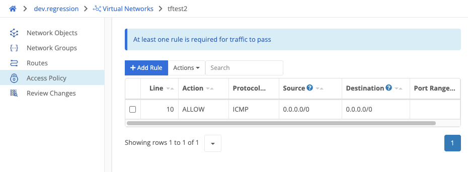

{}
An access policy is a list of rules that each allow, reject, or drop traffic at the VPN level.
{}
 
If no rules are defined, traffic will not pass through the [virtual network]().

 **A rule can match traffic based on the following fields:**


Whether to ALLOW, DROP, or REJECT the traffic.

  

You can choose ANY, UDP, ICMP, or TCP.

  

The source of the traffic. You can select a network object (link), a network group (link), or provide a CIDR.

  

The destination of the traffic. You can select a network object (link), a network group (link), or provide a CIDR.
 


Rules are evaluated starting with the lowest numbered - rule. Once a rule matches, later rules are ignored even if they might also match the traffic (confirm w/ Steven)



For TCP and UDP traffic, you can specify a port (e.g., 80) or a range (e.g., 8000-9000).


**Note that _all specified_ fields must be matched for the rule to match. (confirm w steven).**