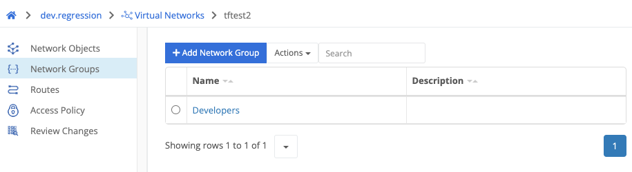

{}
A network group is a list of [network objects]() that allows for easier rule management.
{}

A network group requires a name to be set. This will be used to reference the group in [access policy]() rules.

Navigating into a network group allows management of the group’s member objects.

