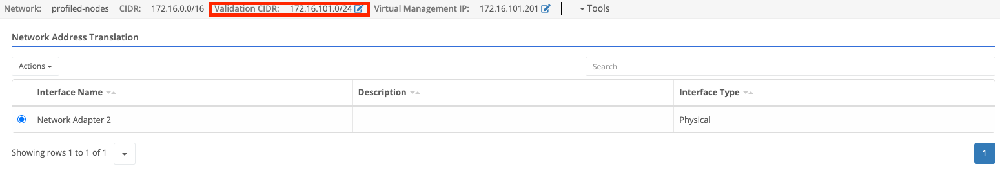
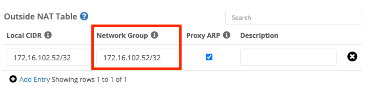
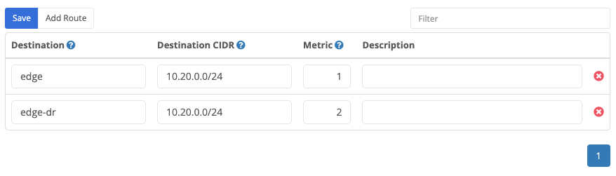

{}
Routes configured under [Domains]() determine to which [node]() or [cluster]() the [Trustgrid virtual network]() should route traffic for a specific subnet.
{}

## Route Configuration

1. Login to the portal and select [`domains`]().
2. Click the link to the desired domain under the "Name" column.
3. Scroll down to the ["Virtual Networks"]() section and select the `Routes` tab.

A Route has Three Required Fields:


This will be the name of the [node]() or [cluster]() that traffic will be routed to. This list is auto-populated based on the nodes and clusters in the selected [domain]().



This is the CIDR notation of the [virtual network]() that should be routed to the above destination [node]() or [cluster]().



If there are multiple routes for the same [virtual network]() the metric will determine which route will be used. The lowest number is the highest priority. See the "Automatic Failover" text below.


## Route Failover 

Route failover allows a subnet to be routed to an alternate [node]() or [cluster]() in the event of a failure.  This can be automatic or performed manually.

### Prerequisites 

In either configuration, the [virtual network]() settings under [VPN]() settings for the primary and backup destination [nodes]()/[clusters]() must match. Including:

- Network Virtual Route
  

- Network Group under Outside NAT Table
  

- Virtual CIDR under Inside NAT Table

  

### Automatic Failover

To have the route failover without manual intervention you must define two routes for the same subnet (Destination CIDR) with different metrics.  The lowest numerical metric will take precedence unless the destination [node]() or [cluster]() is offline.

In the below example configuration we want traffic for the 10.20.0.0/24 network to the `edge` [cluster]() first, and failover to the `edge-dr` [cluster]().

### Preventing Automated Failback or Forcing a Failover

As mentioned above if multiple routes are configured traffic will route to destination with the lowest metric number. So if the primary destination fails but then comes back online traffic will be routed back automatically.

However, there are some circumstances where this is not desirable. For example, if the primary site is unstable you may wish to keep traffic at the backup site until the primary is stabilized. Alternately, you may wish to preemptively reroute traffic to the backup site in advance of planned maintenance at the primary site.

To preemptively reroute traffic to the backup site, update the backup route to have a lower metric than the primary route.

### Manual Failover

In some circumstances, it may be preferable for failover to only occur with manual intervention. In this situation, you will have a single route under the [domain]().  To initiate a failover you'll need to update the destination [cluster]()/[node]().

1. Login to the Portal and select your domain.
2. Click the link to the desired [domain]() under the "Name" column.
3. Scroll down to the ["Virtual Networks"]() section and select the "Routes" tab.
4. Find the route you wish to failover.
5. Update the destination device. (e.g. in the below you would switch from edge to edge-dr).
   (add screenshot of instructions NEEDS TO BE FIXED)
6. Click save.
