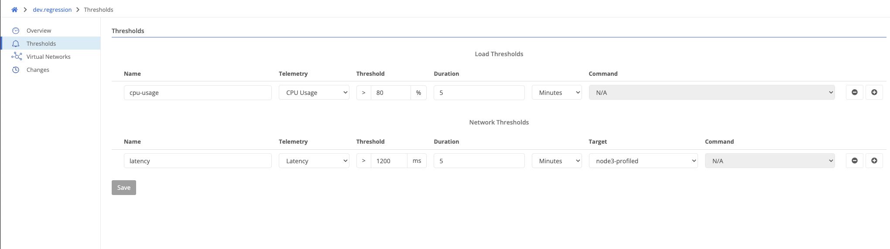

{}
Thresholds provide a way to trigger events when different measurements exceed a given value. Thresholds configured at the domain level apply to all nodes in the domain, except when overridden. Events will be of type `Metric Threshold Violation`.
{}

Navigate to your domain, and click `Thresholds` on the left.

### Load Thresholds

Load thresholds measure the health of the node itself.


The name of the threshold. This will be available in generated events.



The metric to monitor. Options are CPU usage (%), memory usage (%), disk usage (%), and embryonic flows (absolute count).



The value that must be exceeded for an event to be generated.



The time period to measure. If the threshold is exceeded for this duration, an event will be generated.


### Network Thresholds

Network thresholds measure the health of the network from the node's perspective.


The name of the threshold. This will be available in generated events.



The metric to monitor. Currently only latency (measured in milliseconds) is available.



The value that must be exceeded for an event to be generated.



The time period to measure. If the threshold is exceeded for this duration, an event will be generated.



The target node to measure the latency to. Each node will measure the latency to the target node.

