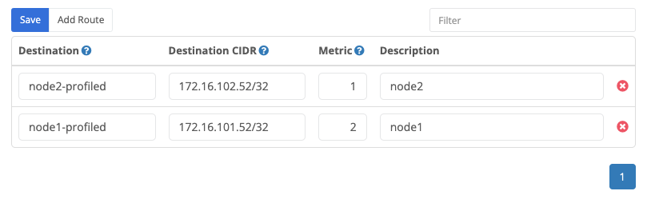
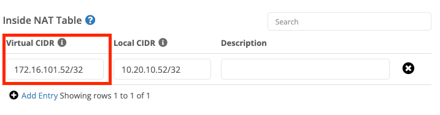
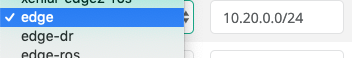

{}
Routes configured under [Domains]() determine to which [node]() or [cluster]() the [Trustgrid virtual network]() should route traffic for a specific subnet.
{}

## Virtual Network Routes
Routes defined a the virtual network level allow creating a global route table shared with all nodes and clusters attached to the virtual network. This table is then used to evaluate where to send VPN traffic for a specified destination CIDR.

### Route Fields
A Route has the following fields:



This will be the name of the [node]() or [cluster]() that traffic will be routed to. This list is auto-populated based on the nodes and clusters in the selected [domain]().



This is the CIDR notation of the [virtual network]() that should be routed to the above destination [node]() or [cluster]().



If there are multiple routes for the same [virtual network]() the metric will determine which route will be used. The lowest number is the highest priority. See the "Automatic Failover" text below.


 (Optional) This field can be used to provide additional information about the purpose of the route.  e.g. it could label a route as a DR route indicating that in normal circumstances it would have a higher metric than a primary route.



## Managing Virtual Network Routes

### Adding Virtual Network Routes

1. Navigate to Domain > Virtual Networks and select the desired Virtual Network.
1. The Routes table is selected by default  Tip: Use the search field to filter the list of routes so you can see the routes you are adding. You could filter by the CIDR address or part of the destination node/cluster names. This will show any existing matching routes, and will make it easy to see the new routes you are adding.
1. Click the add route button.
1. Provide the desired route information in the [fields](#route-fields) <ol type="A"><li>Select the destination cluster or node</li><li>Enter the destination network in CIDR notation. For a single IP use /32.</li><li>Enter a metric between 1 and 200.</li><li>Optionally, provide a description.</li></ol>
1. Repeat the above two steps for any additional routes you wish to add.
1. Click the Save button. 
1. There should be a notification saying "Routes Updated" but you will need to [review and apply changes]() before the changes are actually be published to nodes in your environment. 
    
 As stated above, the route changes are not actually implemented until you click the Apply button the [Review Changes]() panel. 

### Deleting Virtual Network Routes

1. Navigate to Domain > Virtual Networks and select the desired Virtual Network.
1. The Routes table is selected by default 
1. Use the search field to filter the list of routes. You could filter by the CIDR address or part of the destination node/cluster names. This will show any existing matching routes, and will make it easy to see the new routes so you can delete them.
1. Click the red X on the far right of the route being removed. 
1. Repeat the above two steps for any additional routes you wish to add.
1. Click the Save button. 
1. There should be a notification saying "Routes Updated" but you will need to [review and apply changes]() before the changes are actually be published to nodes in your environment. 

## Route Failover 

Route failover allows a subnet to be routed to an alternate [node]() or [cluster]() in the event of a failure.  This can be automatic or performed manually.

### Prerequisites 

In either configuration, the [virtual network]() settings under VPN settings for the primary and backup destination [nodes]()/[clusters]() must match. Including:

- Network Virtual Route

  

- Network Group under Outside NAT Table

  

- Virtual CIDR under Inside NAT Table

  

### Automatic Failover

To have the route failover without manual intervention you must define two routes for the same subnet (Destination CIDR) with different metrics.  The lowest numerical metric will take precedence unless the destination [node]() or [cluster]() is offline.

In the below example configuration we want traffic for the 10.20.0.0/24 network to the `edge` [cluster]() first, and failover to the `edge-dr` [cluster]().

### Preventing Automated Failback or Forcing a Failover

As mentioned above if multiple routes are configured traffic will route to destination with the lowest metric number. So if the primary destination fails but then comes back online traffic will be routed back automatically.

However, there are some circumstances where this is not desirable. For example, if the primary site is unstable you may wish to keep traffic at the backup site until the primary is stabilized. Alternately, you may wish to preemptively reroute traffic to the backup site in advance of planned maintenance at the primary site.

To preemptively reroute traffic to the backup site, update the backup route to have a lower metric than the primary route.

### Manual Failover

In some circumstances, it may be preferable for failover to only occur with manual intervention. In this situation, you will have a single route under the [domain]().  To initiate a failover you'll need to update the destination [cluster]()/[node]().

1. Login to the Portal and select your domain.
1. Click the link to the desired [domain]() under the "Name" column.
1. Scroll down to the ["Virtual Networks"]() section and select the "Routes" tab.
1. Find the route you wish to failover.
1. Update the destination device. (e.g. in the below you would switch from edge to edge-dr).
  
1. Click save.
