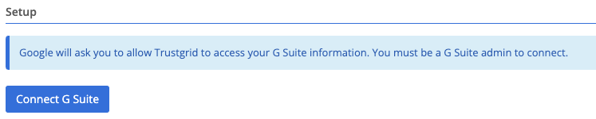

#### Setup

Setting up the G Suite integration requires a G Suite administrator to perform the configuration.

Once the integration has been successful, the user sync selection will be presented:  

- Sync all users - Syncs all available G Suite users along with all the groups associated to the users
- Sync users from specific groups - Syncs all users from the selected groups
- Disconnect G Suite - Deletes all users and groups and removes the G Suite integration


- Once the initial manual sync has occurred, automatic synchronization will happen once a day.
- Automatic synchronization guarantees up to date view of users and their corresponding groups. 
- At any given point the sync selection can be changed and saved, and the sync will automatically start. 


