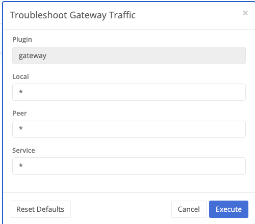

{}
Gateway nodes accept TLS tunnel connections from other nodes in the domain. They are responsible for routing traffic between nodes.
{}

Gateways are only configurable at the node level. Configuring a gateway requires `nodes::configure:gateway` permissions.

## Gateway Types

A gateway can be one of three types:

- `public` - allows all connections from edge nodes in the domain
- `private` - allows only allow-listed clients to connect
- `hub` - allows connections from edge nodes and other gateway nodes

A public gateway should be secured with a firewall to prevent unauthorized access.

## Configuration

Navigate to a node and select `Gateway` under the `System` section.


Either `Enabled` or `Disabled` - when enabled, the node will listen and accept connections from other nodes.



Whether to allow UDP tunnels to be established through this gateway.



The public IP or DNS name of the gateway. This is the address that other nodes will use to connect to this gateway.



The port that the gateway will listen on. This is the port that other nodes will use to connect to this gateway.



The port that the gateway will listen on for UDP tunnels. This is the port that other nodes will use to connect to this gateway.



The ingress bandwidth limit for the gateway. Connections will be throttled when this limit is reached.



When using DNS for gateway connections, you may specify an uploaded [certificate]({{ ref "/docs/certificate" }}) to use for TLS connections.



The type of gateway. See [Gateway Types](#gateway-types) for more information.



Whether to monitor latency to peers through this gateway. This can have a performance impact and is not recommended for high-traffic gateways.


### Client Settings


The egress bandwidth limit for the gateway. Connections will be throttled when this limit is reached.


Private gateways only allow connectivity from listed and enabled clients. To add a client, use the typeahead textbox at the bottom of the clients table and select the desired node.

#### MPLS Traffic

Gateways of all types allow configuring paths for MPLS traffic.


A name for the path.



Gateway for which the path is applicable.



Destination IP address for the path.



Destination port for the path.



Bind the connection to this IP address.



Make this the default path for the gateway.


## Gateway Tools

To see detailed messages about gateway traffic, select the `Troubleshoot Gateway Traffic` option from the services menu under `Gateway Tools`.

This will open a new window with live diagnostic messages about traffic

