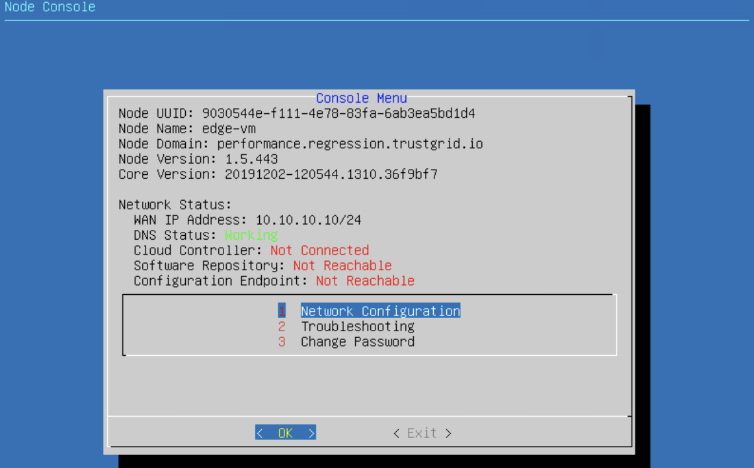
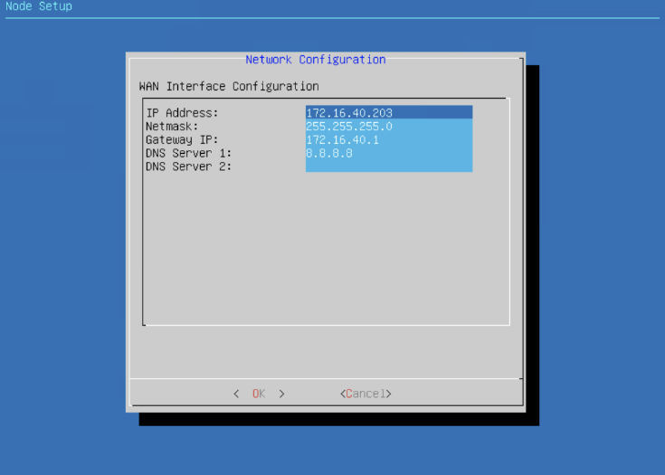
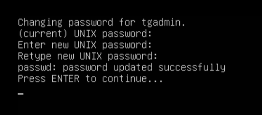

{}
The Trustgrid node console allows local console access to a Trustgrid Node whether a physical or esx node for the purposes of IP reconfiguration or network level troubleshooting and verification. 
{}

### Accessing the Trustgrid Console Utility

#### Connecting to Trustgrid Local Console
- The following physical nodes can be connected via Keyboard and Monitor
    - Netgate - HDMI Monitor output, USB Keyboard
    - Protectli RM8B - VGA Monitor output, USB Keyboard
    - Dell Precision 3240 compact - DisplayPort Monitor Output, USB Keyboard
- The following devices support connecting  a serial cable connected to a laptop/desktop with the settings in the table below

| Device | Serial Port Type | Speed (bps) | Data Bits | Parity | Stop Bits | Flow Control |
|--------|------------------|-------------|-----------|--------|-----------|--------------|
| Lanner NCA-1210 | RJ45 | 115200 | 8 | None | 1 | None |
| Lanner NCA-1515 | RJ45 | 115200 | 8 | None | 1 | None |
---
 - VMware and Hyper-V based nodes can utilize the native console tools for each respective platform
 - Node console is not supported on AWS nodes 

#### Logging In
- Login with username tgadmin and password of mac address of the wan nic of the device all lowercase including colons. Example 82:f5:48:a9:14:05 

- The mac address can be seen on the node page in the shadow. Depending on device type it will be enp2s0 for netgate / enp0s20f1 for lanner or ens160 for esx.

### Trustgrid Local Console Dashboard
As seen below the console dashboard displays information on the current version of software the node is currently running as well as the connectivity/network status. 

The first screenshot shows a healthy node that is able to successfully resolve public DNS names and connect to Trustgrid’s control plane. The second screenshot shows a node that is able to resolve DNS but unable to connect to the Trustgrid Control Plane. 

### Changing a Trustgrid Node WAN IP via Trustgrid Console
> After the IP address is changed locally it must connect to the Trustgrid Cloud Controller and the new IP address must be saved in the portal to make the change permanent. If the device is rebooted prior to that it will revert to the previous configuration.
To change the nodes WAN IP address select option 1.

Configure new static IP or select DHCP and select ok to save the changes. The IP should be updated in the Trustgrid Portal when the IP is changed. There will be a prompt in the portal to import the new IP settings. 

After the IP address has been changed and the device connects to the Trustgrid control plane the new IP configuration will need to be imported and saved.  If you do not have portal access please work with Trustgrid Support 

### Changing the Default Password
The tgadmin user’s password can be changed by selecting option 3.

You will then need to enter the current password (mac address of wan nic all lowercase with colons) followed by the new password. 

> After this password is changed it can only be reset if the device successfully connects to the Trustgrid control plane. Please ensure the password is appropriately documented for future use.

