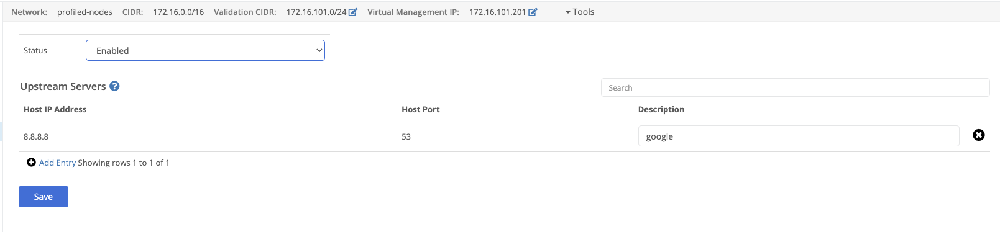

Nodes can act as DNS servers for the virtual network. Find DNS definitions and change them under the `DNS` section of the VPN configuration.

## Upstream Servers

Upstream servers will be used to answer DNS queries for domains that are not in the virtual network.

The upstream DNS server's IP address
The upstream DNS server's port (usually 53)
