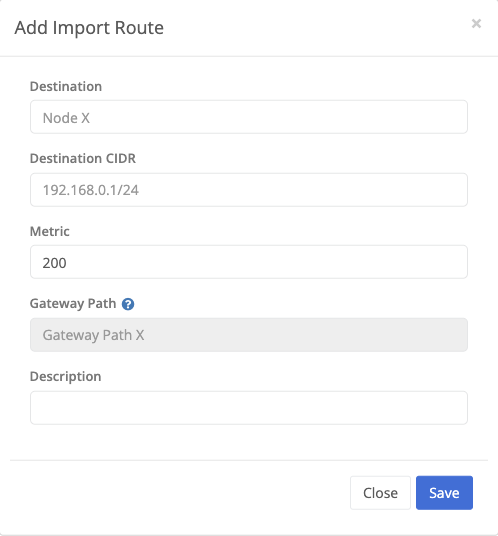

Dynamic routing allows a node to export and import routes from other nodes in the virtual network. Find dynamic route definitions and change them under the `Dynamic Routing` section of the VPN configuration.

## Exports

Export routes for other nodes in the virtual network to import.

The node to route traffic to.
The network to route traffic to.
The route metric. Lower metrics are processed first.
An optional gateway path to use for the route.

## Imports

Import routes from other nodes in the virtual network.

The node to route traffic to.
The network to route traffic to.
The route metric. Lower metrics are processed first.
An optional gateway path to use for the route.
