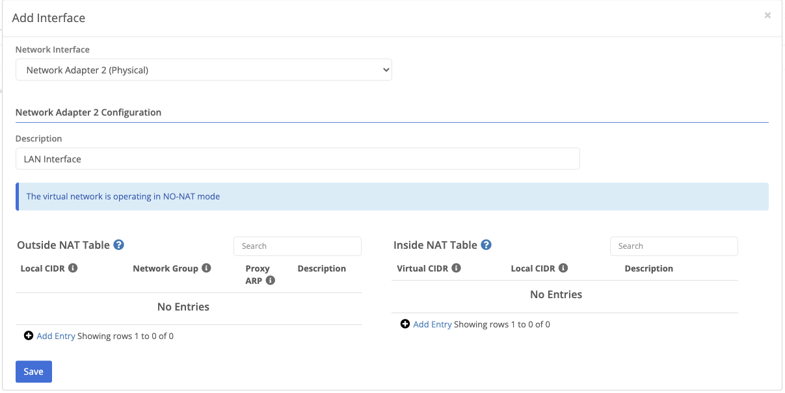

{}
NATs allow Trustgrid to alter the source and/or destination IP address of layer 3 traffic as it enters or leaves the VPN.
{}

## Adding an Interface

NATs are scoped to an interface. Add an interface from the `Actions` menu.

## Inside NATs

An inside NAT defines how a local device IP address translates into a virtual network address. For instance, a local device may have a local IP address of 192.168.1.100, but you may want it to appear to other devices or applications on the virtual network as IP address 10.0.20.100. Or you may want an entire block of local IP addresses to show up on the virtual network as a different block. You can do this translation via Inside NATs. Inside NAT's also control what local devices can participate on the virtual network. If a local device does not have an inside NAT configured that includes its IP address, it can't access or be accessed by other devices on the network. Inside NATs require the following information:

The local IP address or address block that should be mapped into the virtual network. It should be entered in CIDR block format (eg - `192.168.100.0/24` or `192.168.100.51/32`).

The network IP address or addresses that the local IP addresses should be mapped to, also entered in CIDR block format.

Network addresses map 1x1 with local addresses, so the prefix length (the /xx number of the CIDR) should be the same in both the local and network CIDR blocks of the inside NAT entry.

## Outside NATs

By default, when a device on the local network of a node receives traffic from a remote device on the network, the remote device IP address will be the IP address that was entered in the local CIDR block for the remote node's inside NAT entry for the remote device. For instance, if the remote device was mapped to network address 10.0.100.1, then its traffic on the local network will appear to come from IP address 10.0.100.1. However due to the local network configuration, there may be some situations where it is desirable to translate remote network addresses before egressing onto the local network. For instance on a local network of 192.168.0.0/16, a user may want the remote devices virtual network IP of 10.0.100.1 to be translated to 192.168.50.5 so that it fits better into the local network setup. This kind of translation can be achieved by adding outside nats. To add an outside NAT you must enter the following information:

The network IP address or addresses that should be translated before egressing onto the local network. This should be entered in CIDR block format.

The local IP address or addresses that the network addresses should be mapped to, also entered in CIDR format.

An outside NAT is required for all nodes and clusters using the virtual network

Note there are situations where it may be desirable to make multiple remote devices masquerade as one local IP address though the use of port address translation (PAT). This can be achieved by defining an outside nat in which the network CIDR contains a larger address space than the local CIDR. For instance, an entry with network CIDR 10.0.1.0/24 and local CIDR 192.168.100.10 would make all remote devices with network IP addresses in 10.0.1.0/24 appear as IP address 192.168.100.10 on the local network.
