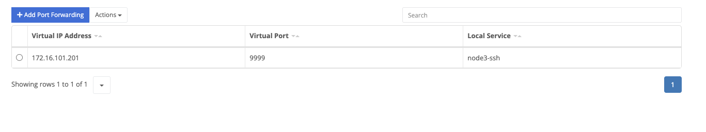

Port forwarding allows a node to expose an [L4 service]() on the virtual network.

The IP to expose the service on the virtual network.
The port to expose the service on the virtual network.
The service to expose.
