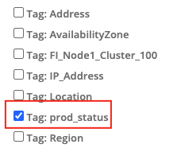
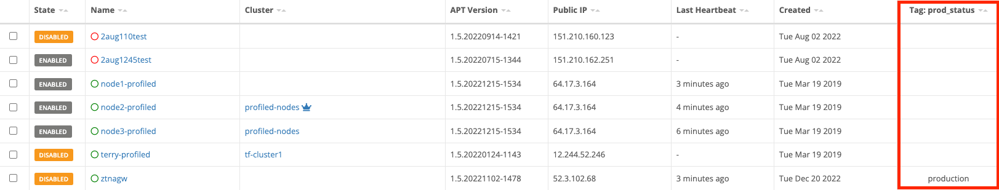

{}
A node is an instance of software used for building connections, managing compute resources, and deploying software.
{}

A node can be installed on a hardware appliance, as a virtual appliance (Vsphere and Hyper-V), and deployed in a public cloud (Amazon AMI, Google, Microsoft). There are three main types of nodes - Edge, Gateway, and Management.

Edge nodes create TLS tunnels to all gateway nodes provisioned in a domain. Edge nodes also create TLS tunnels to Management nodes operated by Trustgrid.

Gateway nodes accept incoming tunnels from Edge nodes.

All Trustgrid nodes run on a hardened Ubuntu operating system. Nodes are managed through the Trustgrid portal or via the API (requires authentication token). A local UI exists to support the reconfiguration of an ethernet interface and diagnostic/network tests prior to connection to the Portal.

### Adding a Tag as a Column on the Nodes Table

Adding a tag as a column on the nodes tables is good way to make valuable information visible for multiple nodes at the same time. To add the column:

1. Navigate to the nodes table page
1. Click `Actions` and then select `Columns` from the dropdown

3. Towards the bottom you will see all the available tags in the format `tag: tag-name`. Select the desired tag and click `Save`.

The column will be added and the table can now be sorted by that column. Any node that does not have that tag set will be listed as blank.

### Applying a Tag Filter to the Nodes Table

The nodes table can also be filtered to only show nodes with a specific tag name:value.

1. On the nodes table click `Actions` and select `Add Tag Filter` from the drop-down menu.

1. After clicking `Add Tag Filter`, select the tag-name field and you will see a list of tag-names available. Select the desired tag.

You can also start typing to filter what tag names are shown.

3. Select the tag value field and you will see a list of available values. Select the desired value.

4. (Optional) Click `Add Tag Filter` to include an additional filter. Note that the two filters will be applied using AND only nodes with both tag name:value combinations matching will be shown.

5. Click `Apply Tag Filter` and the table will only show matching nodes.

