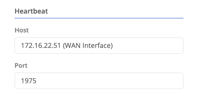

Cluster configuration is only available for nodes that are members of a [cluster]().

## Heartbeat

The cluster heartbeat defines a persistent connection between cluster members. The heartbeat is used to determine the health of the cluster and to determine which member is the active member. This configuration is required on cluster members.


The IP (bound to an interface) on which heartbeat communication will occur
The port on which heartbeat communication will occur


The same interface should be selected for all cluster members

## Status Endpoint
(Optional) The Status Endpoint allows you to start an HTTP REST endpoint on a port on the WAN interface IP that will return a 200 response if the member is healthy and the active cluster member. This is commonly needed if a load balancer is being placed in front a cluster to provide high-availability for ZTNA or Wireguard gateway traffic. 


Hard set to the WAN interface IP address
Defines the port that the HTTP server will listen on. 

If blank the HTTP server will be disabled. 
