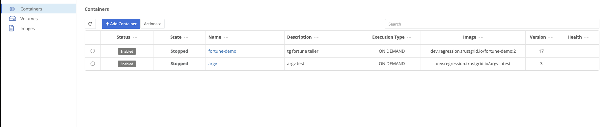
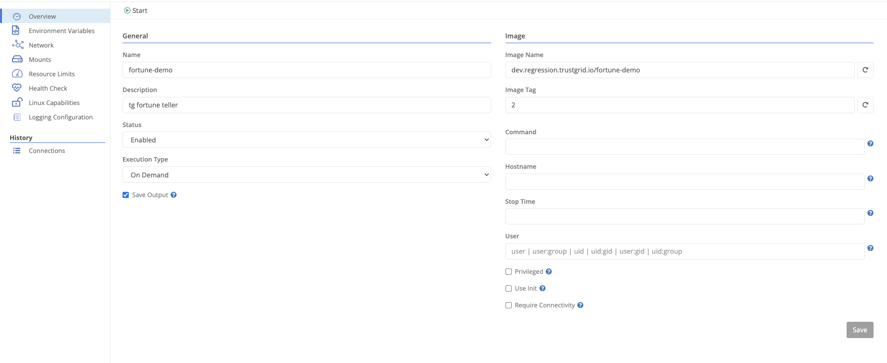
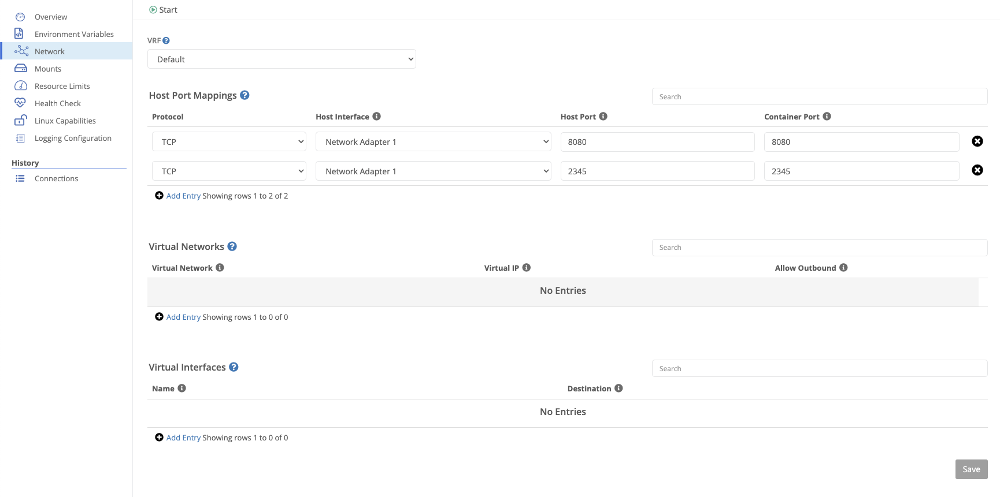
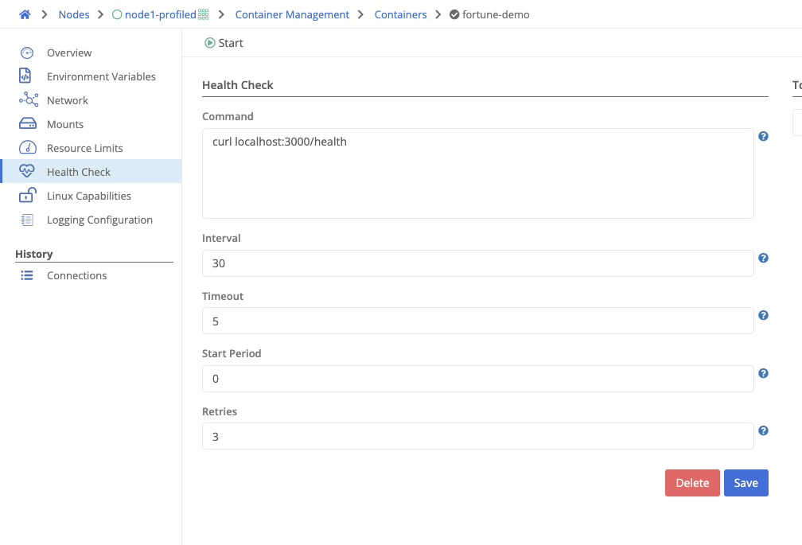
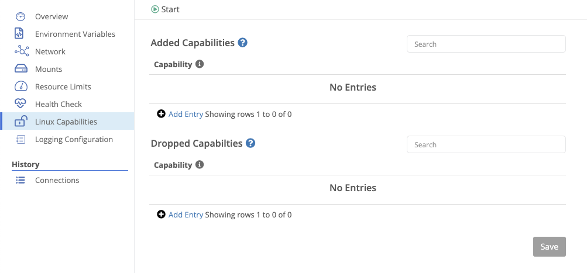
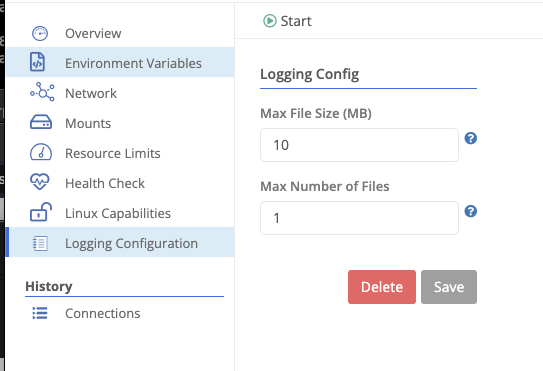

Trustgrid nodes support running Docker containers which allows for ease of deployment across an organization. Any Docker container is supported with the exception of containers that require root level access.

The container can be attached to both the local and virtual network space which allows both local and remote resources to communicate with the container. For example an API could be deployed on a Trustgrid Gateway which sends API Calls via the virtual network space to a container running on a Trustgrid Edge Node. The API call could then be translated to make a call to a database running on the local network and passed back up to the gateway host.

Before adding a container to a node, push an image to your [repository]().

Reading and managing containers requires `node-exec::read` and `node-exec::modify` permissions, respectively. Executing a container requires `node-exec::compute` permission.

## Management

Navigate to `Container Management` under `Compute` on a node or cluster.

Here you can add, enable, disable, delete, and import a container.


The name of the container.
A container can be deployed as one of three types.

1. **Service** - the container is created and will run as a daemon. If the node reboots, the container will start up automatically.
1. **Recurring** - the container will run on a defined schedule. A schedule parameter is defined for the frequency, either as a rate or a [cron expression](https://crontab.guru/examples.html).

   | Rate               | Description          |
   | ------------------ | -------------------- |
   | `rate(30 minutes)` | Run every 30 minutes |
   | `rate(1 hour)`     | Run every hour       |
   | `rate(1 day)`      | Run every day        |

1. **On Demand** - typically used for testing. The container is executed for a single session, but will not restart on its own.
   
   Only enabled containers will run.
   The name of the image to execute.
   The image tag to execute.
   

## Overview

Navigating into a container, the overview section allows editing basic information about the container's execution environment.

In addition to the fields above, you can modify:


The command to execute inside the container.
The hostname set inside the container.
The grace period (in seconds) to allow a container to stop before killing it. Defaults to 30 seconds.
Sets the username or group or uid or gid in the container.
Persist standard output/standard error.
Grant the container extended privileges.
Use an init process inside the container as PID 1. This ensures responsibilities of an init system are performed inside the container (e.g., handling exit signals).
Ensures that the container will not start if it has encrypted volumes and is unable to reach the control plane.


## Environment Variables

Environment variables can be added to a container to provide configuration information to the container at runtime.

## Network

The networking section allows you to configure the container's VRF, its port mappings, and its virtual networks and interfaces.

### Host Port Mappings

Host port mappings allow you to expose a port on the host to the container. This is useful for exposing a service running in the container to the local network.


The protocol to listen for. If not specified, all traffic is forwarded to the container.
The host interface to listen on.
The host port to listen on.
The container port that will receive the mapped traffic.


### Virtual Networks

Attaching a virtual network to a container allows virtual network traffic to reach it.


The virtual network to attach.
The virtual IP to assign to the container.
Whether the container should be allowed to make outbound connections into the virtual network.


### Virtual Interfaces

A virtual interface can be mapped to a container to forward all traffic.


The virtual interface name.
The interface destination inside the container.


## Mounts

Mounts allow a container to persist data either as an externally defined [volume](), or a bind mount of the node's filesystem.


Either `BIND` or `VOLUME`. For type `VOLUME`, the mount must reference an existing [volume]().
For volumes, the name of the volume. For bind mounts, the path on the node's filesystem.
The mount location inside the container.


## Resource Limits

Containers can be restricted to limit the amount of resources they can consume from the host.


Maximum CPU allocation. Default is 50%.
Hard limit for RAM allocation. Default is 50% of the host's memory.
Soft limit for RAM allocation. Cannot exceed hard limit. Default is 45% of the host's memory.
Max allowed bytes per second of IO reads. Disabled by default.
Max allowed bytes per second of IO writes. Disabled by default.
Max allowed IO read operations per second. Disabled by default.
Max allowed IO write operations per second. Disabled by default.


Linux ulimits can be set for each container. Supported ulimits are:

- CORE
- DATA
- FSIZE
- LOCKS
- MEMLOCK
- MSGQUE
- NICE
- NOFILE
- NPROC
- RSS
- RTPRIO
- RTTIME
- SIGPENDING
- STACK

## Health Check

A health check can be configured to monitor the container's health. If the health check fails, the container will be restarted.


The command to run. A non-zero return code indicates a health check failure.
The frequency (in seconds) to run the health check.
How long (in seconds) to wait for the health check to complete. A timeout is considered a failure.
Grace period (in seconds) during container startup before health checks should start.
Number of allowed health check failures before marking the container unhealthy.


## Linux Capabilities

Linux capabilities can be added to or removed from a container, allowing fine-grained control over kernel-level features and device access.

## Logging Configuration

Log files (when persisting container output) are rotated based on a size threshold.


The maximum size (in MB) of a log file before it is rotated.
The maximum number of log files to keep.

