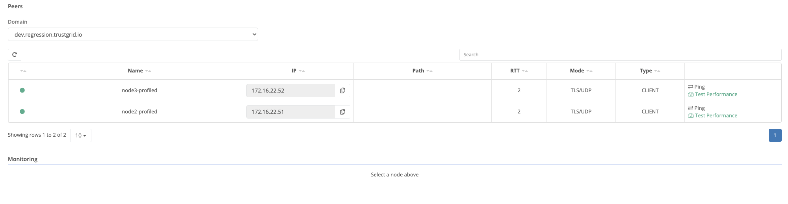
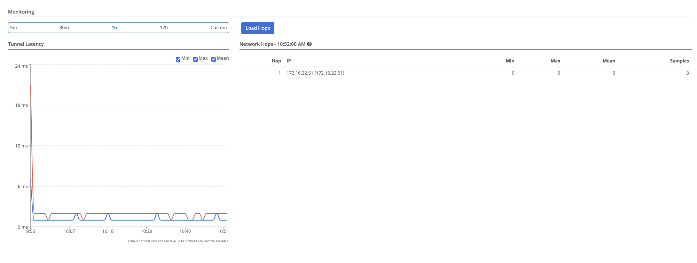

{}
Data plane statistics between a node and its peers can help troubleshoot connectivity or performance issues.
{}

To view latency data between two nodes, select either the edge or gateway node, and then from the peers table, select the node to view.

Gateway nodes will list edge nodes in their peers table

Once a peer is selected, the monitoring section will populate with reelvant data.

Hop data is only available for nodes that have hop monitoring enabled. See [Monitoring Network Hops to Peers]().
