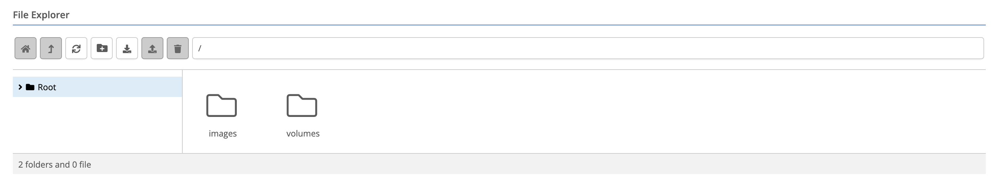
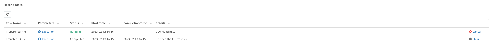

{}
The data store allows artifacts (i.e. container volumes, virtual machine images) to be synced from/to a node.  The data store view is located under Compute > Data Store.
{}

### File Explorer

Allows a user to navigate, sync, create directories, delete artifacts from the data store.

-  - Takes you to the Root of the directory hierarchy.
-  - Takes you up one directory from your current location in the directory hierarchy.
-  - Refreshes the directory hierarchy to get the latest state of the data store.
-  - Create a new sub directory. See [Directory Creation]() for more information
-  - Transfer a file to the data store. See [File Sync]() for more information
-  - Upload a file from the data store. See [File Sync]() for more information
-  - Delete a file from the data store.

### Recent Tasks

Allows a user to view the status of any long running tasks (i.e. Transfer file from Amazon S3, Upload file to HTTP endpoint, etc).  Any task that is executing can be cancelled.  Completed tasks can be cleared manually or they will be automatically removed 6 hours after completion time.

