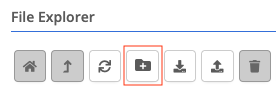
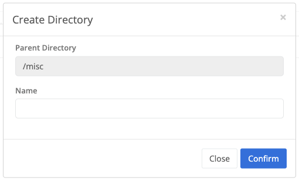

{}
Data store directory creation allows you to add new directories to organize your files in a hierarchical, tree-like structure.
{}


The destination where the directory will be created can be changed by selecting a particular directory as the parent from the [File Explorer]() side bar.




The data store location where this directory will created.


The name of the directory to create.

