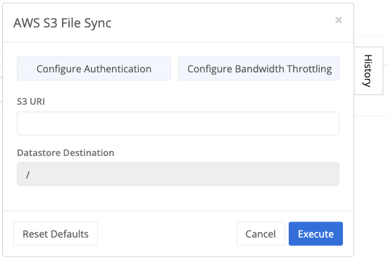
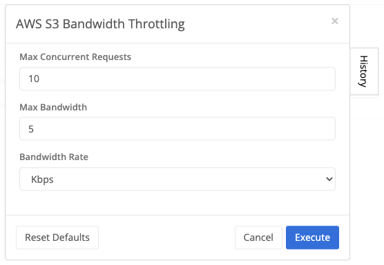
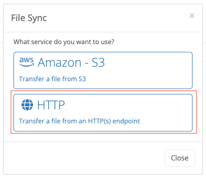
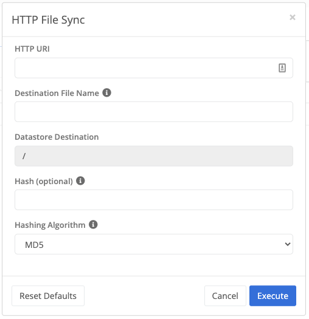
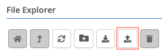
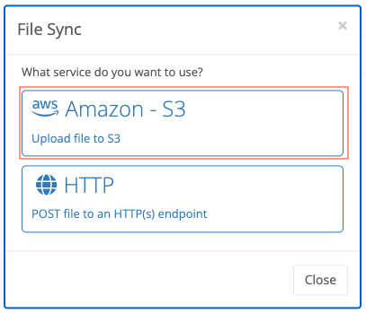
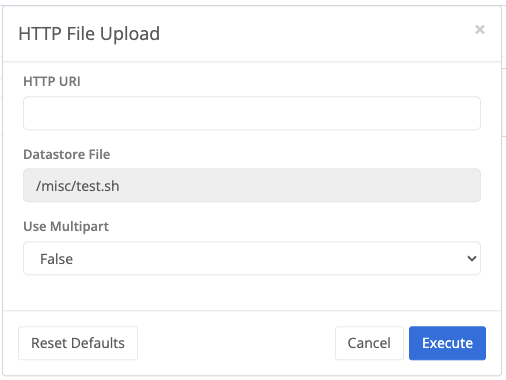

{}
File syncing allows a user to transfer files to the data store as well as upload files from the data store.
{}

## Transfer Files

A user can populate the data store by transferring files from an Amazon S3 bucket or from an HTTP endpoint.


The destination where the file will be stored can be changed by selecting a particular directory from the [File Explorer]() side bar.


#### Amazon S3 Transfer

A user can select to transfer a file from an S3 URI.

##### Sync File



The S3 URI for the location of the file to transfer.


The data store location where the file will be transferred to.



##### Configure Authentication

In order to be able to utilize the S3 File Sync option, valid AWS credentials need to be configured on the node for the applicable S3 buckets.

##### Configure Bandwidth Throttling

The S3 File Sync service will always try to utilize as much bandwidth as possible to perform the transfer of the file.  If the amount of bandwidth needs to be limited, a user can configure the amount of bandwidth allowed to be utilized in Kbps/Mbps/Gbps.



The maximum number of concurrent requests allowed.


The maximum bandwidth that will be consumed for uploading and downloading data to and from Amazon S3.


Rate associated to the Max Bandwidth specified.  Supported values are Kbps, Mbps, and Gbps.




In general, it is recommended to first use Max Concurrent Requests to lower transfers to the desired bandwidth consumption. The Max Bandwidth setting would then be used to further limit bandwidth consumption if setting Max Concurrent Requests is unable to lower bandwidth consumption to the desired rate.


#### HTTP Endpoint Transfer

A user can select to transfer a file from an HTTP endpoint.  The endpoint has to be unauthenticated since the node currently doesn't support providing credentials.

##### Sync File



The HTTP URI for the location of the file to transfer.


The transferred file will be saved with this name under the datastore destination.


Optional fields used to validate the integrity of the transferred file.


If a hash is specified, this specifies the hashing algorithm used during validation of the file.



***

Upload Files

A user can extract files from the datastore by uploading them to an Amazon S3 bucket or to an HTTP endpoint.


A file needs to be selected first before the File Upload button gets enabled on the [File Explorer]() menu bar.


#### Amazon S3 Upload

A user can select to transfer a file to an S3 URI.

##### File Upload



The S3 bucket URI for the location where the file will be uploaded.


The data store file to upload.




For configuration of AWS authentication and Bandwidth Throttling refer to [Configure Authentication]() and [Configure Bandwidth Throttling]()


#### HTTP Endpoint Upload

A user can select to upload a file to an HTTP endpoint.  The endpoint has to be unauthenticated since the node currently doesn't support providing credentials.

##### File Upload



The HTTP URI for the location where the file will be uploaded.


The data store file to upload.


Used to denote if multipart should be used when uploading the file. True for use multipart and false otherwise.




The node uses the POST method to perform the HTTP upload
