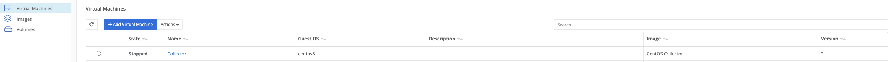
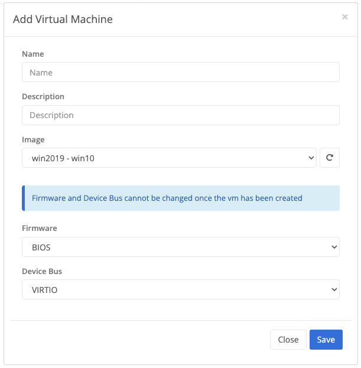
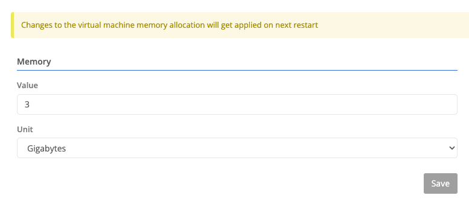
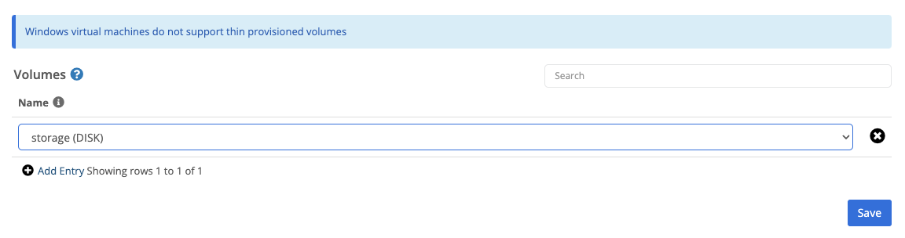
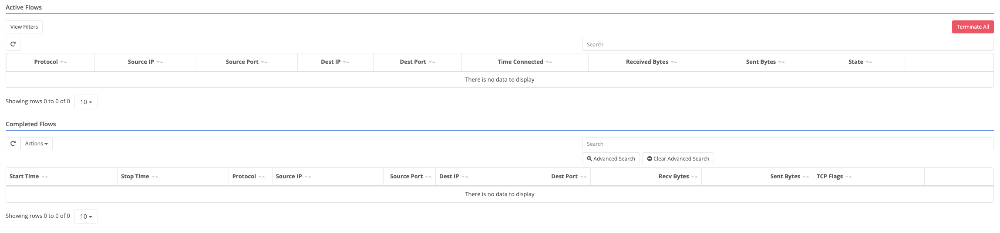

Trustgrid nodes can deploy virtual machines (if supported) using the open source virtualization technology `Kernel-base Virtual Machine (KVM)`which allows the node to act as a hypervisor to run multiple, isolated virtual guests.

The virtual machine can be attached to both the local and virtual network space which allows both local and remote resources to communicate with the virtual machine. For example an API could be deployed on a Trustgrid Gateway which sends API calls via the virtual network space to a virtual machine running on a Trustgrid Edge Node. The API call could then be translated to make a call to a database running on the local network and passed back up to the gateway host.


Before being able to deploy a virtual machine to a node, an [image]() needs to be created.


## Management

Navigate to `VM Management` > `Virtual Machines` on a node.



Name of the virtual machine.


Description for the virtual machine.


Image selected from the ones available.


Boot firmware for the virtual machine.
1. BIOS
1. UEFI


Device Bus used for deployment of the virtual machine.
1. VirtIO
1. IDE
1. SATA



## Overview

Navigating into a virtual machine, the overview section allows editing basic information about the virtual machine's execution environment.



Name of the virtual machine.


Description for the virtual machine.


Image selected from the ones available.


Operating System of the Image.


Hostname given to the virtual machine on deploy.


Denotes how long to wait for the virtual machine to gracefully stop before killing the process.  Default is 2 minutes.


Boot firmware of the virtual machine.


Device Bus used for deployment of the virtual machine.


Indicates the virtual machine should automatically start after deploy.



## CPU

Virtual machine CPU allocation.

## Memory

Virtual machine Memory allocation in GB, MB, KB, or Bytes.

## Network

The networking section allows you to configure the virtual machine's VRF, its port mappings, and its virtual networks and interfaces.

### Host Port Mappings

Host port mappings allow you to expose a port on the host to the virtual machine. This is useful for exposing a service running in the container to the local network.


The protocol to listen for. If not specified, all traffic is forwarded to the virtual machine.
The host interface to listen on.
The host port to listen on.
The virtual machine port that will receive the mapped traffic.


### Virtual Networks

Attaching a virtual network to a virtual machine allows virtual network traffic to reach it.


The virtual network to attach.
The virtual IP to assign to the virtual machine.
Whether the virtual machine should be allowed to make outbound connections into the virtual network.


### Virtual Interfaces

A virtual interface can be mapped to a virtual machine to forward all traffic.


The virtual interface name.
The interface destination inside the virtual machine.


## Volumes

Allows mapping disks or cd-roms to a virtual machine.

## Snapshots

Allows the creation, restoration, and deletion of virtual machine snapshots.


The snapshot name.
The timestamp when the snapshot was created.
The state of the virtual machine when the snapshot was created.

1. Extenal Disk Only - Mode applied to the snapshot when the firmware of the virtual machine is UEFI.
1. Internal - Mode applied to the snapshot when the firmware of the virtual machine is BIOS.  This mode includes the guest virtual machine state.

If this is a child snapshot, this references the parent snapshot.
The snapshot description.


Every snapshot operation is tracked asynchronously.  You can keep track of the status of every snapshot creation, restoration, and deletion via the `Recent Tasks` table.

## Cloud Init

Cloud-init is a simple and powerful way to configure virtual machines during deployment.  You can manage user creation, install updates, configure network, etc.


You can find the full cloud-init documentation **[here](https://cloudinit.readthedocs.io/en/latest)**


***

## History

Shows active and completed traffic flows for the virtual machine.


Active flows can be manually terminated.


