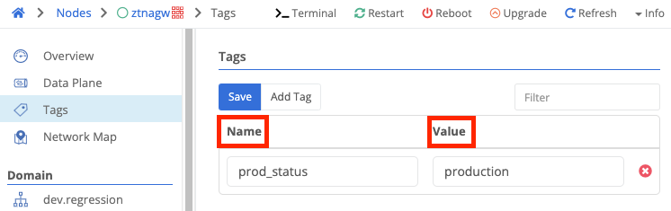

{}
A tag is a name / value pair that can be used to provide additional information about a Trustgrid resource ([nodes](), [clusters](), etc).
{}

Tags are useful when managing enterprise-scale deployments of [nodes](). Tags allow the user to identify quickly and easily a [node]() or group of [nodes]() with the same property. Both the name and value of the tags are set by the user. Names should provide the context and values provide the actual data. For example, to provide the address of a device you would set the name to `address`, and the value to something like `123 Main St`.

It is a best practice for Trustgrid customers to standardize on a set of tag names and appropriate values. This increases the consistency of use across your organization. When adding tags the existing tag names and associated values will be prepopulated as options.

Some common uses of tags are:

- Supporting information (production status, contact info, hours of operation, escalation)
- On-premise/edge location information (site name, address, pin code)
- Configuration (High availability, instance type, region, disaster recovery)


Tag names and values are case-sensitive and should only consist of letters, numbers, dashes (`-`), and underscores (`_`).


### Viewing Tags

There are multiple ways to view tags.

#### Viewing Node Tags from the Node Detail Page

After navigating to a specific node’s detail page you can view the tag by:

* Opening the Tags panel from the left side navigation bar:
	
	

* Opening the info panel by clicking `Info` in the top right or by clicking the ` (backtick) key

	

### Modifying Tags

To add a tag:

1. Navigate to the `Tags` section of a node. 

1. Click `Add Tag`.

1. A new row will appear at the bottom of the tags table. There will be a list of existing tag names for your organization. You can filter the list by typing in the field. You can either select an existing tag name, or create a new one by typing it out in full and then selecting `New selection: tagName`.

	

1. Next move to the values field. As with the name, existing values will be listed. To enter a new value type it in completely.

1. Click `Save`

Tag rows can be edited in-place. Change the name or value, then click `Save`.

To remove a tag, click the red X next to the tag name, then click `Save`.
