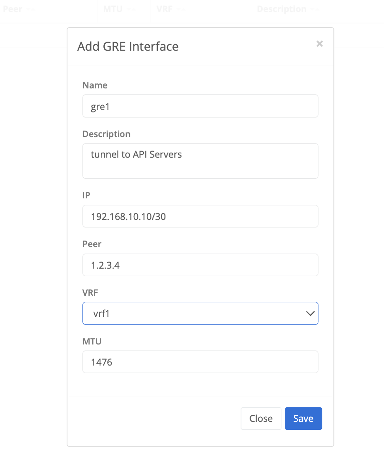

{}
Trustgrid supports configuring GRE tunnels that can be used to establish connectivity to any appliance that supports the GRE protocol.
A GRE tunnel interface is created which can then be attached to an interface on a node. VRFs can then be used to control the flow of traffic and how it should appear on the network. 
{}

## Configure GRE Tunnel 
On a Trustgrid Node navigate to Tunnels under the Network Menu and select Add Tunnel and then select GRE

### GRE Tunnel Configuration Parameters

- Name - the name of the GRE tunnel interface that will be created on the Trustgrid node
- Description - optional field to used to document the purpose of the tunnel
- IP - the ip address the tunnel is created with in CIDR
- Peer - the remote IP address of the appliance the tunnel is being established with
- VRF - existing VRF on the node the tunnel is being associated to 
- MTU - the MTU of the tunnel interface. Typically can be set to 1476. 
