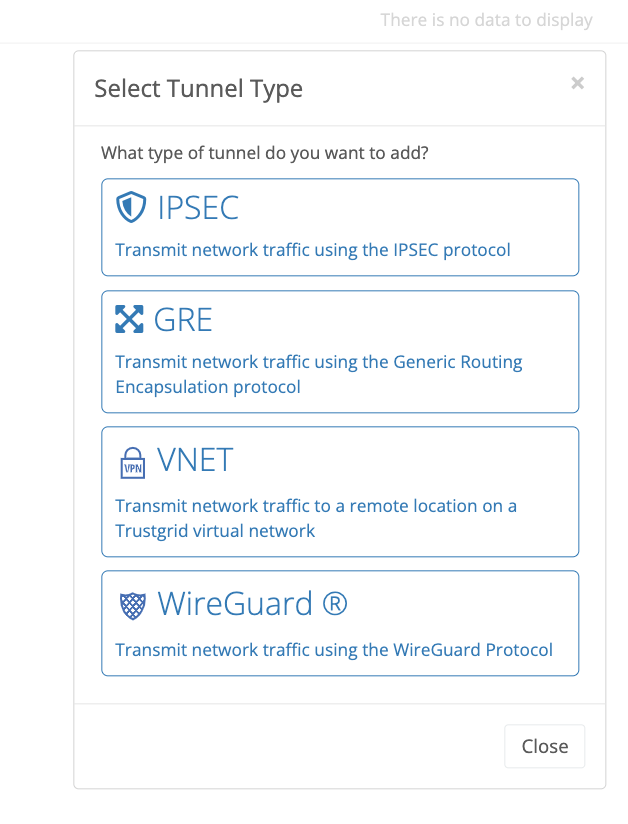
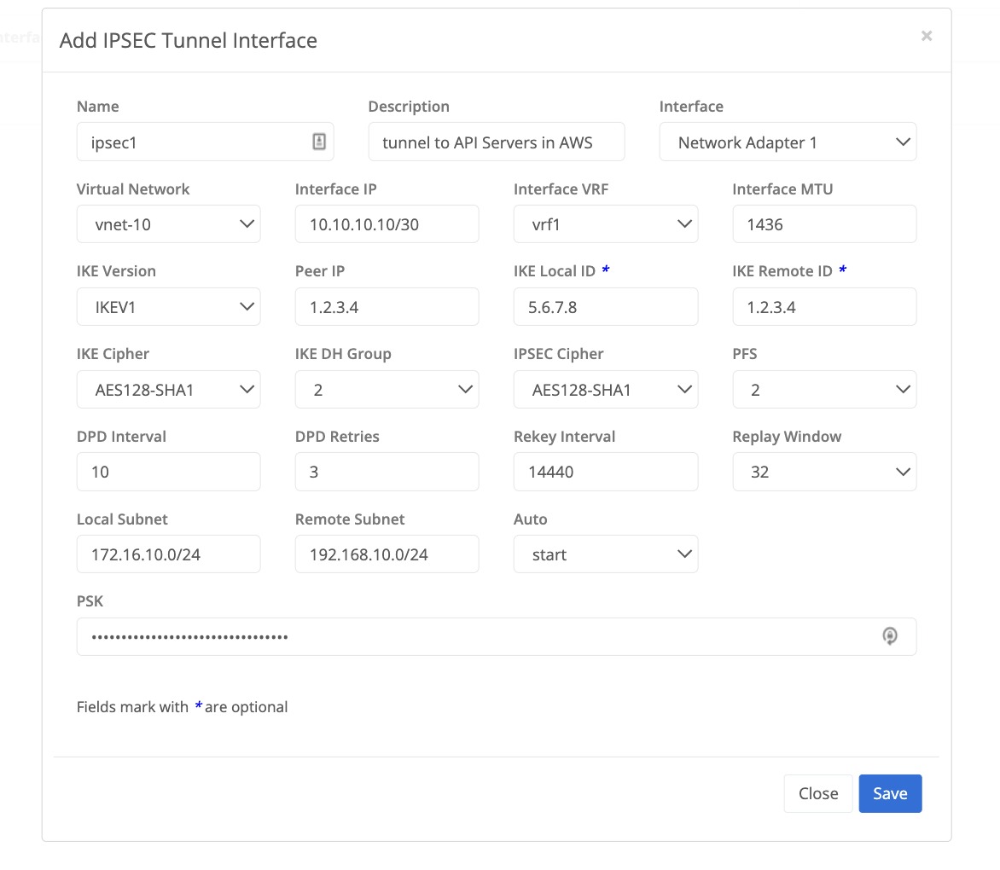

{}
Trustgrid supports configuring traditional IPSec tunnels that can be used to establish connectivity to any appliance that supports the IPSec protocol. 
Once an IPSec tunnel is configured an IPSec virtual interface is created that can be attached to a node interface. VRFs can be used in conjunction to explicitly control what traffic is allowed (VRF ACLs) to pass and how it should look on the network (VRF NATs or Traffic Rules).
{}

## Configure IPSec Tunnel
On a Trustgrid Node navigate to Tunnels under the Network Menu and select Add Tunnel and then select IPSEC

### IPsec Tunnel Configuration Parameters

#### Required Parameters

- Name - the name of the IPSec tunnel interface that will be created on the node and displayed in the Trustgrid Portal 
- Description - used to document the purpose of the tunnel 
- Interface - the network interface the tunnel will be listening on. Typically this will be network adapter 1 which is the WAN interface
- Interface IP - the ip address the tunnel will be created to use in CIDR. Typically this would be a /30. 
- Interface VRF - the VRF the tunnel will be associated with in order to apply ACLs / NATs / Routes or Traffic Rules
- Interface MTU - the specified MTU of the tunnel interface. Typically this can be left to the default of 1436
- IKE Version - select version 1 or version 2 
- Peer IP - The remote ip address of the appliance the tunnel is being established with
- IKE Cipher - The cipher used for phase 1
- IKE DH Group - The Diffie-Hellman Group used for phase 1
- IPSEC Cipher - the cipher used for phase 2
- PFS - The Diffie-Hellman Group used for phase 2 perfect forward secrecy 
- DPD Interval - seconds for dead peer detection 
- DPD Retries - number of dead peer detection retries before the tunnel is re-keyed / torn down
- Rekey Interval - time in seconds before a re-key of the tunnel is initiated 
- Replay Window - size of the replay window which is used to prevent replay attacks. Typically set between 64 and 128
- Local Subnet - the local subnet in CIDR that will be considered interesting traffic and be allowed to forward over the tunnel 
- Remote Subnet - the remote subnet in CIDR will be considered interesting traffic and be received on the tunnel 
- Auto Add  - the connection is added and then waits for the remote peer to initiate the tunnel establishment
- Auto Start - the connection is added and then attempts to initiate the tunnel to the remote peer
- PSK - the pre-shared key used by both peers to establish the tunnel

#### Optional Parameters
- Virtual Network - associate the tunnel to a Trustgrid Virtual Network 
- IKE Local ID - The IP address that will be seen by the remote peer to establish the tunnel. Typically this would be the public facing WAN IP of the Trustgrid Node.
- IKE Remote ID - Used for identity validation. Typically this is the same address as the Peer IP

