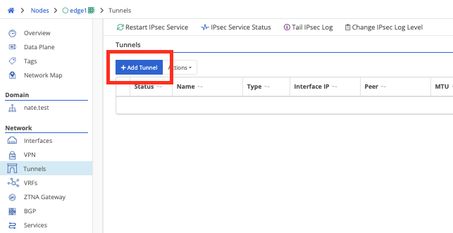
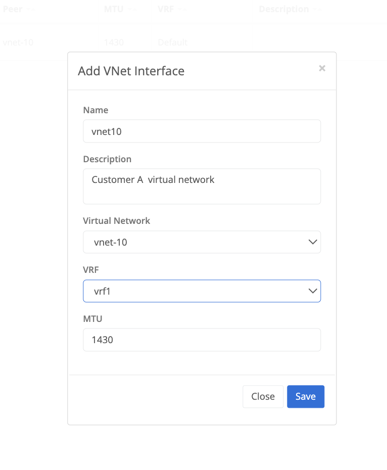

{}
A virtual network tunnel interface can be configured on a Trustgrid node or cluster to allow forwarding of traffic to a remote Trustgrid Node or Cluster that is attached to the same virtual network. The tunnel interface is associated to a vrf which is used to define and control what traffic is allowed to pass and how it should appear on the network. There is no attachment of the vnet interface to a node interface required but the virtual network does need to be attached to the node or cluster before the tunnel interface is created. 
{}

## Configure Vnet Tunnel
On a Trustgrid Node navigate to Tunnels under the Network Menu and select Add Tunnel and then select VNET

#### Configuration Parameters

- Name - the name of the tunnel interface created on the Trustgrid Node or Cluster
- Description - optional descriptive parameters related to the tunnel 
- Virtual Network - the Trustgrid virtual network the tunnel is being associated to. The virtual network should already be attached to the node or cluster to be selectable. 
- VRF - The vrf the tunnel is being associated to. Only vrf's which exist on the Trustgrid Node or Cluster can be selected
- MTU - the mtu size of the tunnel interface. Typically the default of 1430 should be used
