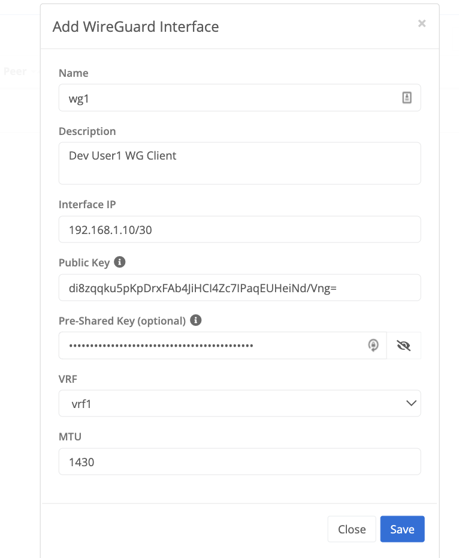

{}
A wireguard tunnel interface can be configured to allow a wireguard client to connect to a Trustgrid Node running as a wireguard server. 
The tunnel interface is associated to a vrf which is used to define and control what traffic is allowed to pass and how it should appear on the network.
{}

## Configure Wireguard Tunnel
On a Trustgrid Node navigate to Tunnels under the Network Menu and select Add Tunnel and then select Wireguard

#### Wireguard Configuration Parameters

- Name - the name of the wireguard tunnel interface created on the Trustgrid node or cluster
- Description - optional field used to document what clients are utilizing the tunnel
- Interface IP - the ip address in CIDR the wireguard tunnel interface will be created as
- Public Key - the public key of the remote wireguard client
- Pre-Shared Key - optional 256 bit to provide an additonal level of security 
- VRF - the vrf that exists on the Trustgrid node or cluster the tunnel interface is associated to 
- MTU - the MTU of the wireguard tunnel interface. Typically this can be left at 1430

