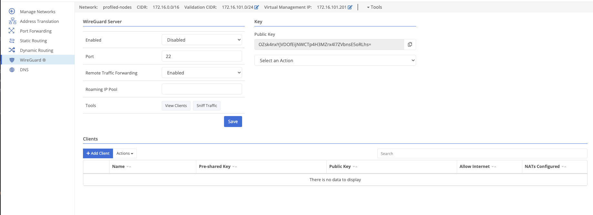
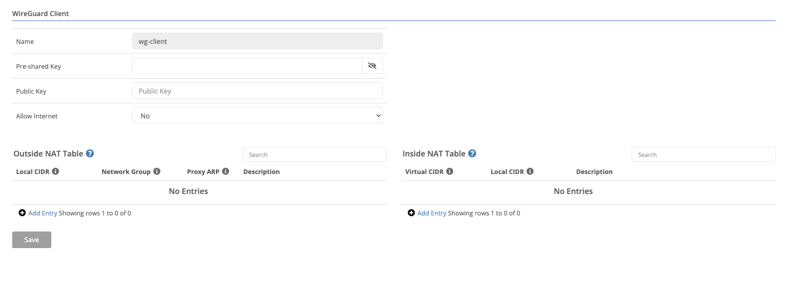

Nodes may enable a WireGuard server to expose the virtual network to WireGuard clients.

## Configuration

When enabled, this node will accept WireGuard client connections
The port clients should connect to
Whether the node should forward traffic to the virtual network

## Key Management

Clients will need the server's public key to connect. This can be generated (using the `Regenerate` action) or can be derived from the private key (imported using the `Import` action).

Changing the server's private key will disconnect existing clients and require their reconfiguration.

## Clients

Clients must be added before they can connect.

Each client will need to generate their own private and public key. Most WireGuard clients provide tools to do this.

The name of the client
(Optional) The client's pre-shared key
The client's public key
Whether this client should be allowed to access the public network through this server

An inside NAT should be created to map the client's local IP to an IP on the virtual network. The virtual network CIDR should not be a part of any existing routes in the domain. The IP should be included in an outside NAT network group, so that an ACL can allow the traffic.

An outside NAT should be created that includes the virtual network used on the gateway side.

_"WireGuard" is a registered trademark of Jason A. Donenfeld._
