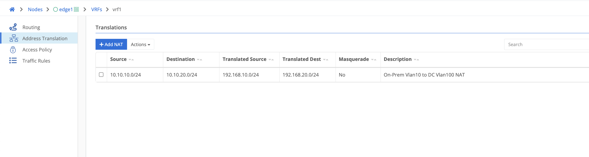
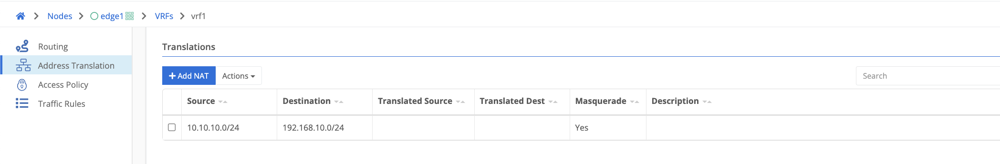
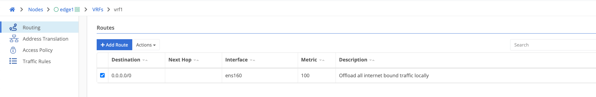

### Overview

VRFs can be used route / nat and filter what traffic is allowed to pass and how it should appear on the network. VRFs can be associated to an interface whether it be a physical interface / virtual network interface or other tunnel interfaces such as ipsec or gre. VRFs are segmented on a layer 3 level from all other traffic traversing the Trustgrid node.

For standard use cases of source nat and/or destination nat creating a route and a NAT is sufficient. Traffic rules can be used for more advanced controls. An applicable ACL is required for any traffic to pass as a zero trust methodology is applied.

### Address Translation

This is where NATs are created in order to translate the traffic to appear as desired on the network.
NATs support translating both source and destination CIDRs as well as masquerading as the egress interface address.

###### SNAT / DNAT Example

Using the example NAT below if a source packet was initiated from 10.10.10.100 destined for 10.10.20.100 the source address would be translated to 192.168.10.100 and the destination address would be translated to 192.168.20.100.
It is important to note that nat translations occur before routing decisions are made.

###### Maquerade Example

Using the example below if a source packet is initiated from within 10.10.10.0/24 destined for anything in 192.168.10.0/24 the source would be translated to the interface address the packet is egressing on. If it was a single interface Trustgrid node it would be sourced as the wan facing interface address.

### Routes

Note that NAT translations happen before routing so routes should be created for the destination NAT CIDR if applicable.
Routes require a destination CIDR, interface and metric.
A next hop is optional and only applicable for non-tunnel interfaces such as physical interfaces or vlan subinterfaces.
The gateway of the applicable interface will be used if no next hop is defined.

The example below would be used for example to offload all internet bound traffic directly out the WAN facing interface

### Traffic Rules

Traffic rules can be used for more advanced granular traffic manipulation beyond standard source and destination nat.
There are many more parameters that can be applied to the traffic depending on the specific use case.
When creating a traffic rule an ACL is required for traffic to pass. The available parameters are defined below.
Rules are evaluated based on the line number. The first matching rule is the one that will be applied to the packet.
More specific rules should always be implemented above less specific rules. Eg a rule for a /24 network should be above a /16 network the /24 is included in.



The line number the rule is applied to. Rules are matched in numerical order.



All traffic rules have an action that is applied to the associated packet.

- Accept - The packet is allowed to be processed locally.
- Drop - The packet is dropped and not responded to
- Reject - A TCP Reset is sent in response
- Forward - The packet is forwarded to its defined destination such as an interface or another VRF
- Mirror - Packets are not manipulated but can be mirrored for inspection purposes.
  For example passing through an IDS container such as Snort.
- Log - The packet is not manipulated but is marked for logging
  


The traffic rule is applied to packets that ingress on this interface



Packets are forwarded out this interface once the rule is applied



The protocol that the rule should apply to. All, ICMP, TCP or UDP



Packets are forwarded into another VRF that is associated on the node. Only configureable when a forward action is selected.



The source network the rule should apply to



The destination network the rule should apply to



Translate and source all packets from the nodes interface address when enabled



Forward all traffic to the DNAT destination IP/Port. For example in order to forward all http traffic through a proxy



The destination mac address defined overwrites the source mac address of the packet. Necessary only for some container deployments such as Snort inpsecting traffic.



Used to define a port range when creating a traffic rule



###### Traffic Rule Example

In the below example the first rule on line number 1 is forwarding all traffic destined to 10.0.20.0/24 to a virtual network tunnel interface. Any NATs configured under Address Translation will be applied before the packet is forwarded to its destination. The rule on line number 10 will forward all traffic that does not match the first rule out to the internet masquerading as the WAN interfaces address.
If the line numbers were reversed the virtual network rule would never be matched as all traffic would match the internet offload rule which is configured for all source and destination traffic.

