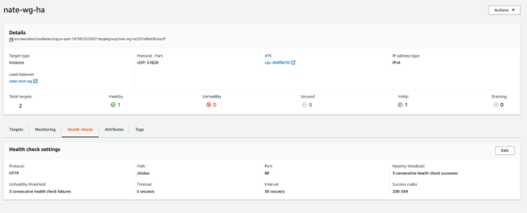
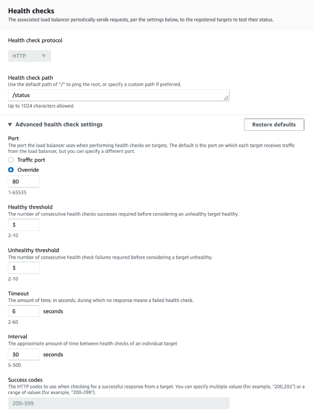
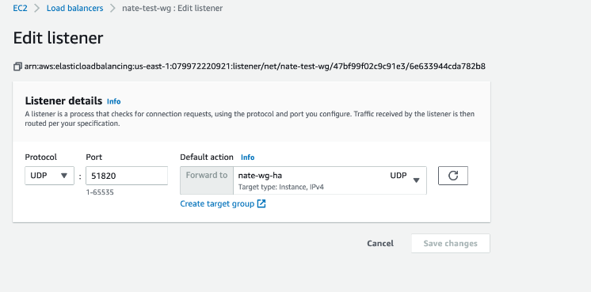

1. Create EC2 Target Group and add both Trustgrid gateways with the target being wireguard server port (Default UDP 51820) 

The health check should be set to http with a path of /status and override traffic port to be port 80. 

Only the active member of the Trustgrid Cluster will respond as healthy to the health check.   

2. Create NLB (Network Load Balancer) with listener set to configured UDP wireguard server port (Default 51820) and forwarding to the target group created above. The load balancer should be created as internet facing IPV4 and mapped to the Public facing subnets of the Trustgrid gateways.

