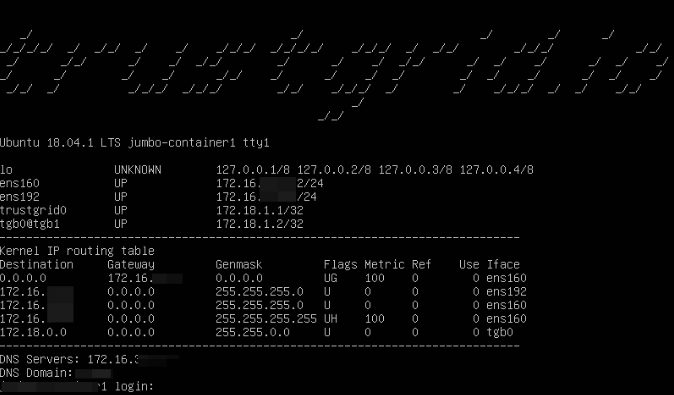
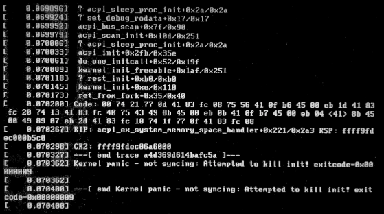
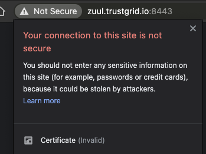

> When the Control Plane is disconnected there is no way to utilize remote tools to resolve the issue so you will need to contact the End-user technical resource for the site to troubleshoot

When troubleshooting the control plane it is a good idea to familiarize yourself with the [Edge Node Startup & Update Communication Process]. 

<table>
<thead>
<tr>
<th> Network Requirements </th>
</tr>
<tr>
<td>
In order to connect to the Trustgrid Control Plane, the following <strong>outbound traffic</strong> must be allowed from the node’s configured primary interface IP address  
<ul>
    <li>TCP Port 443 and TCP/UDP 8443 to:</li>
        <ul>
            <li>35.171.100.16/28</li>
            <li>34.223.12.192/28</li>
        </ul>
    </li>
    <li>TCP/UDP Port 53 to the configured DNS servers. These DNS servers must be able to resolve DNS requests for the trustgrid.io domain</li>
</ul>
</table>

1. Triage the total site connectivity to see if actions can be taken to restore functionality for the edge site while troubleshooting the specific node

2. Confirm with the site tech:

    a. There are no known power or internet issues at the site

    b. No changes have been made to any firewalls between the Trustgrid node and the internet (if applicable). In order to connect the Trustgrid node must have access to the Network Requirements defined above.

3. Have the site tech attempt to ping the inside interface IP address(es) to see if the device is showing as powered up and online. If the site is using a single-interface configuration this would be the Network Adapter 1 - WAN Interface IP(s) in the portal.

    a. If the ping is successful you have determined the device has power and that the operating system and Trustgrid software are running. In this case, you can focus on internet side issues.

    b. If the ping fails, work with the site tech to:

        i. Confirm the node is powered on

        ii. Connect directly to the network of the inside interface and attempt ping from there. They should also connect directly to the inside interface and statically configure an IP in the same network.

4. Attempt power cycling the node by removing power and returning from physical devices or using the hypervisor management tools for virtual nodes.

5. Connect to the console of the device

    a. A normal node looks something like this

    i. Work with the onsite tech to login to the Trustgrid Local Console Utility.  This tools will display connectivity status and allow you to alter the WAN/outside IP settings if needed.

b. If you see a screen like below attempt rebooting the device to restore connectivity. If that works contact Trustgrid support so we can investigate further. 

1. Disconnect the cable from the WAN/Outside port of the Trustgrid node and connect to a laptop NIC.  Statically assign the same IP and DNS settings that the Trustgrid node is using.  Confirm the following:

    a. Using `nslookup` or `dig` to confirm you can resolve zuul.trustgrid.io

    b. Open a browser and navigate to https://zuul.trustgrid.io:8443

        i. If the device can connect to that server and port you should see a warning like this because Trustgrid uses its own Certificate Authority (CA)

        1. Click `Not Secure` and then click `Certificate (invalid)`

        1. You should expect to see a chain like the below.

            a. If there are any different certificates or CAs that indicates something like DPI-SSL/HTTPS Proxy is interfering with the handsake.  See [this page] for resolution requirements.

        ii. If the browser says it cannot connect this indicates a firewall or routing issue upstream.

1. If possible, capture traffic between the Trustgrid node and the internet.  Specifically, the capture should filter to only see traffic from the Trustgrid node’s IP address and TCP port 8443 and TCP/UDP port 53.  Common problems seen include:

    a. Blocked DNS - Edge Node Behavior When DNS Fails 

    b. Blocked port 8443 to the Trustgrid Networks -  Edge Node Behavior When Port 8443 to Trustgrid Public Networks is Blocked 

    c. DPI-SSL or HTTPS altering the TLS certificate chain - Edge Node Behavior When SSL / TLS Certificate is Altered 

# **NEED PROPER LINKS TO USE AND NEED TO FIND HOW TO ADD LINKS TO INDENT FORMAT**

 

