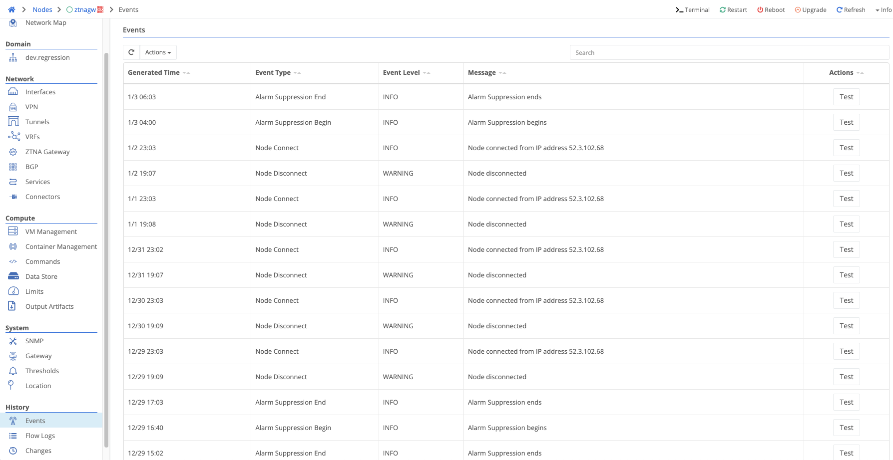
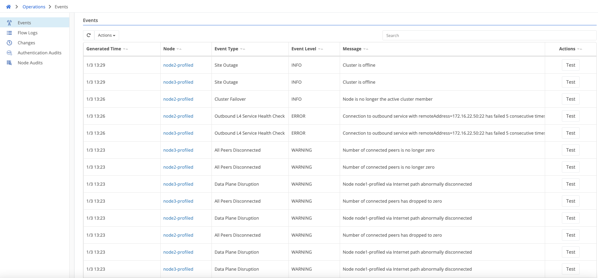

When troubleshooting a problem on edge or gateway nodes, reviewing node events can provide critical information about the nature of the problem. 

1. Choose the node that may be causing the problem
2. Scroll down to `Events`
3. Look for any critical problems

For more issues involving multiple nodes, review [Domain Node Events](need link for this).

1. Choose the `Operations` tab
2. View `Events` across the organization

Types]]()
