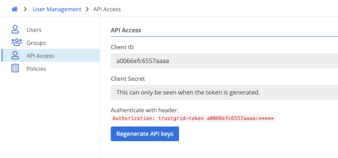

#### Generating an API Key
Navigate to `User Management` -> `API Access`, and click `Regenerate API keys`. This will invalidate your existing API key, if it exists. The API key is tied to your user and will have the same permissions.

> The client secret key will only be available at time of generation - if it's lost, the key will need to be regenerated

#### Using the API Key
To use the API key in a request, pass it in as an HTTP header, like Authorization: trustgrid-token client-id:client-secret
Anything that can be done in the Trustgrid Portal can be done with the API (except for generating an API token).

To query the API for all nodes, for example, you could run:

curl -H "Authorization: trustgrid-token YOUR-CLIENT-ID:YOUR-CLIENT-SECRET" https://api.trustgrid.io/node

In the [API documentation](https://portal.trustgrid.io/api-docs/), clicking `Authorize` at the top right will prompt for the API header.

