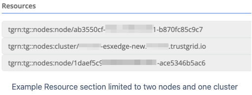
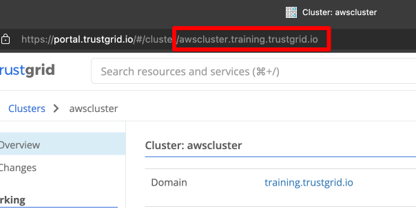
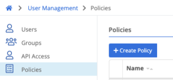

{}
User Management Policies define what an authenticated user is allowed to do within the Trustgrid system. Policies either allow or explicitly deny specific actions by the user.
{}

### Types of Policies

#### Trustgrid Managed Policies

These policies start with the prefix `builtin-tg` and are created and managed by Trustgrid to provide a starting level of permissions based on common user types. Descriptions of the user types for each role are listed below.

As Trustgrid adds new features or actions theses policies will automatically be updated to include appropriate permissions. These policies cannot be edited by customers.

#### Customer Managed Policies

These policies can be defined by customers to meet the specific needs of their teams.

#### Best Practices

- Start by attaching the Trustgrid Managed Policies that best fits the user's minimum, required needs following the principle of “least privilege.”
- If additional permissions are required, create a Customer Managed Policy that includes those specific rights rights. Then attach that policy to the user.

#### Trustgrid Managed Policy Descriptions

Below are the basic descriptions of the Trustgrid Managed Policies including an example role description. Trustgrid will use this description to guide if it is appropriate to add new permissions to the policies.

The policies are listed from lowest permissions to highest.

#### tg-builtin-apps-user

This policy provides minimal permission for a user to connect to the Trustgrid applications portal for using Remote access apps. The user has no rights within the Trustgrid management portal and should likely be given a landing page of `/apps` to be redirected straight to the applications portal.

Target User: End user for remote access applications with no knowledge of the Trustgrid system.

#### tg-builtin-monitor

This policy provides read-only access to non-sensitive resources in the Trustgrid management portal.

Target User: Project manager or executive sponsor that needs to view information in the portal, but does not require tools required to troubleshoot or resolve issues.

#### tg-builtin-operator

This policy provides mostly read-only access but also has the ability to view and use tools within the portal and perform actions to resolve common issues (e.g. restarting/rebooting nodes).

Target User: Entry level technical resources responsible for initial triage of support issues.

#### tg-builtin-node-admin

This policy provides the ability to make changes to most resources but is restricted from making changes that can have a wide impact such as changing a gateway node server settings.

Target User: Mid-level technical resources that need to make changes to things like node VPN configuration and virtual networks routes, but should be restricted from making changes that can impact an entire organization when possible.

#### tg-builtin-admin

This policy has permissions to change almost all resources with the exceptions of Identity Providers and User Management.

Target User: Senior technical resources needing near full access.

#### tg-builtin-access-admin

This policy grants the ability to manage permissions and identity related resources including configuring Identity Providers, Add/Inviting Users, and creating and assigning policies

Target User: Management or access control related resources responsible for granting access to the Trustgrid system.

#### Resource-Scoped Policies

Policies have a Resources section that allow the permissions granted to be limited to specific Trustgrid resources, such as nodes and clusters. This can be used to present a user with an extremely limited view in the portal. For example, an edge site technical contact could be given a login that was only permitted to see the nodes at their site.

 In order to grant users access to the portal a second policy is required granting the `portal::access` permission to the `*` resource.  

#### Trustgrid Resource Names or TGRN

Trustgrid has adopted a resource naming convention that follows the basic format: `tgrn:tg::<service>:<resource-type>/<resource-id>`

###### Wildcard TGRN

By default the Resources field is populated with `*` which grants permissions to all resources. This is included by default for new policies and would need to be removed to provide TGRN restricted permissions.

###### Node TGRN

A node’s TGRN will start with the below prefix:
`tgrn:tg::nodes:node/`
To get the node’s complete TGRN you’ll need to append the node ID which is visible by navigating to the node and either copying from the URL or using the Node ID field in the Info visor drop down

A complete [node]() TGRN looks like: `tgrn:tg::nodes:node/ab3550cf-f3da-4d90-b4b1-b870fc85c9c7`

#### Cluster TGRN

Cluster TGRN start with the prefix:
`tgrn:tg::nodes:cluster/`
This is followed by the cluster’s fully qualified domain name (fqdn) which is the combination of the cluster name and your organizations trustgrid domain. This visible in the URL when you navigate to a cluster in the portal.

A complete [cluster]() TGRN looks like: `tgrn:tg::nodes:cluster/awscluster.training.trustgrid.io`

### Policy Management

#### Creating/Editing Policies

1. Navigate to `User Management` → `Policies`

2. For a new policy click `Create Policy`. To edit an existing find it in the list and click on its name.
3. The policy wizard has two sections. The left section groups permissions by category and is where you allow or deny permissions. The right section shows the resulting JSON of the policy and is read only.
4. As an example we will create a role to grant users the ability to see, edit and comment on Provisioning orders.
   a. Under Permissions, search for `orders`
   b. Click the green check box next to each of the desired permissions. (Clicking the X would explicitly deny that permission which will take precedent over any other policy that allows that permission)
   c. You will notice the Policy JSON updated as you select permissions
   d. Click `Save`

#### Attaching Policies and Viewing Effective Permissions

Policies are attached and their cumulative effect can be viewed under `User Management` → `Users` by selecting the desired user.
