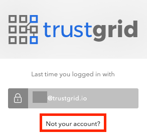
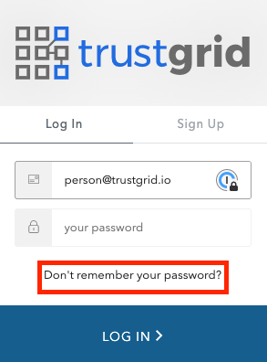
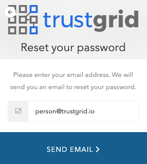
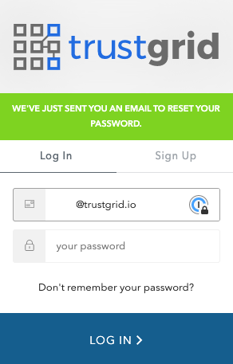
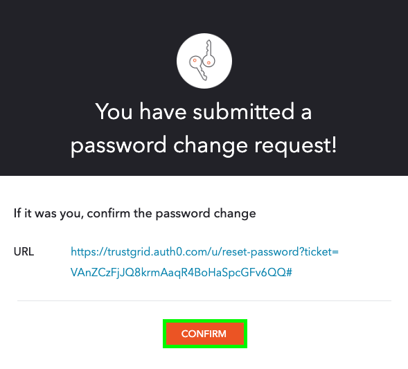

Currently changing password requires users to:
1. Log out of the portal

2. If needed, select `Not your account?`. If yoou don't see this option, ignore this step.

3. On the login page select `Don't remember your password?`

4. Enter your email in the provided text box and click `Send Email` to reset your password

5. You should see a notification that the email was sent on the login page. 

6. In the email, you should see information like the image below. If you still wish to reset your password, click `Confirm`.

7. After clicking `Confirm` you will be taken to a page where you can enter your new desired password. After you finalise it by clicking `Reset Password`, you will be able to log in with your new password.

