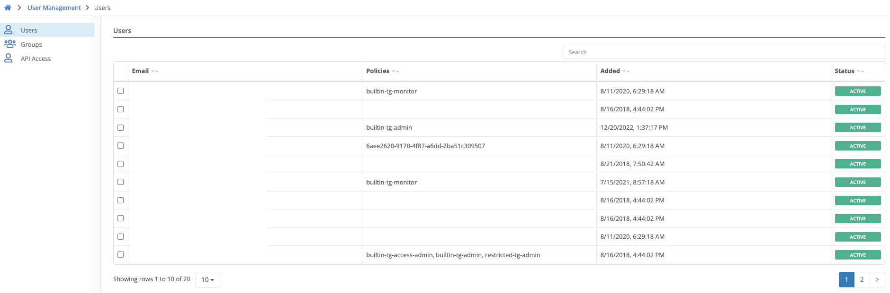
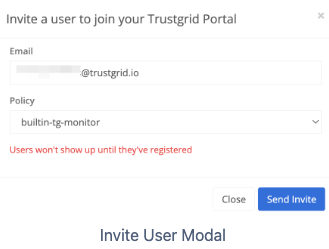
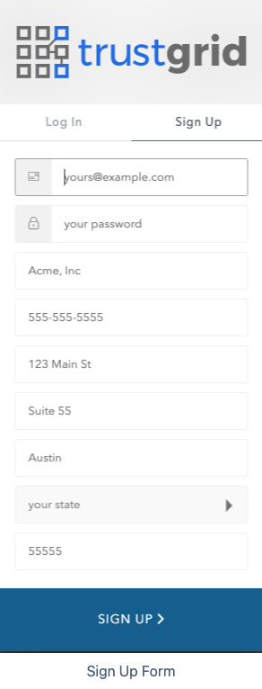
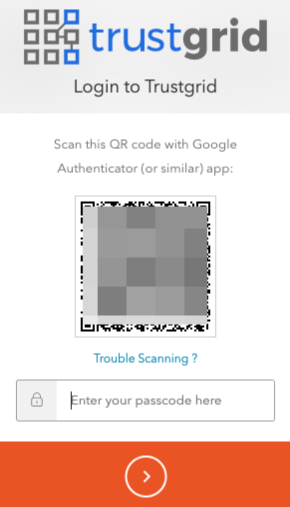
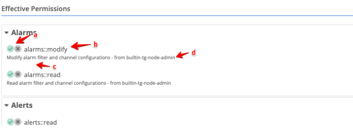
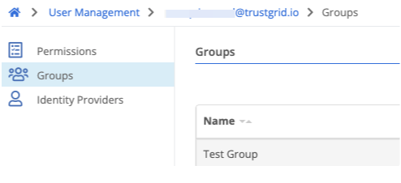

The Users panel is the primary panel for managing user identities and the policies attached to them. All changes in this panel require either the [builtin-tg-acess-admin] policy or similar permissions.

### Adding or Inviting Users

Users can either be invited to the Trustgrid portal and utilize Trustgrid’s native authentication system, or be added and be authenticated by a customer configured Identity Provider (IdP).

#### Inviting Users

For users that will utilize Trustgrid’s native authentication system, you will need to invite them with a valid email address.

1. Navigate to `User Management` → `Users`

2. Under `Actions` select `Invite User`

    a. Enter the user’s valid email address and select the desired base policy (more can be attached later).

Click `Send Invite`.

    i. You should see a confirmation that the invite was sent like the one below.

3. The user will receive an email with a link to the [Trustgrid Portal](https://portal.trustgrid.io) or similar. They will need to click said link.

4. Once at the Portal, the user will need to click the `Sign Up` option. **The user must use the same email address that was invited to get access to your account**.

5. After filling out the required information and clicking Sign Up they will be prompted to configure Multi-Factor Authentication (MFA). Trustgrid recommends using a one-time password MFA such as Authy or Google Authenticator.

a. Scan the QR code with your app

b. Enter the passcode and click the `>`

c. You’ll be provided with a recovery code. Save this in a secure place, confirm it is safely recorded and click the `>`

#### Adding Users (with Identity Providers)

If your account has an Identity Provider configured as a Portal Auth Provider, you use the Add User button to create an identity for them within Trustgrid.

 Some IdP’s allow for users to be synchronized automatically making this step unnecessary 

1. Navigate to `User Management` → `Users`

2. Click the `Add User` button

a. Enter in the user’s email address. **This must be the same email address the IdP sends back to Trustgrid, if unsure consult with your IdP Admin**.

b. Select your Identity Provider (if more than one)

c. Select the desired base policy. More can be attached later.

d. Click `Save`

3. The user can then navigate to the portal authentication domain associated with the IdP. They will be redirected to the IdP page and required to enter their username, password and MFA (if configured), then automatically sent back to the Trustgrid portal.

#### Configuring Users

After a user is added you can drill down into a specific account to:

- Manage attached Policies
- View Effective Permission
- Change a User Landing Page
- View a User’s Group Membership
- View a User’s Associated IdP

#### Manage Policies Attached to a User

To attach/detach policies attached to a user:

1. Under `User Management` → `User search` for the target user and click their name.
2. To add a new policy:
   a. Click `Attach Policy`

   

   b. Search for the desired policy then select it.

   

   c. Click `Attach`

3. To remove a policy from a user:
   a. Click `Detach` (located to the right of target policy)

   

#### View Effective Permissions

To see what permissions a user currently has and what policy is providing that permission:

1. Under `User Management` → `User search` for the target user and click their name.
2. In the right `Effective Permissions` pane, find the permission in question. These permissions are grouped by category. Each entry will show:

   
   a. If the permission is allowed :check_mark:, explicitly denied :x: or not defined (both icons gray)
   b. The action name
   c. A short description of what the permission allows
   d. what policy grants/denies the user the permission

#### Change a User Landing Page

The Landing Page allows you to designate where a user is directed within the portal on initial login. This is most useful for users that only need access to ZTNA Remote Access application at the `/apps` page.

1. Under `User Management` → `User search` for the target user and click their name.
2. Enter in the desired landing page path (e.g. `/apps`) and click `Save`

#### View a User’s Group Membership

You can view all the Groups a user is a member of from the Groups panel. To change memberships you will need to use the `User Management` → `Groups page`.
To view:

1. Under User Management → User search for the target user and click their name.
2. Select the `Groups` panel on the left.
3. `Groups` will be listed in a table in the main panel.

View a User’s Associated Identity Provider (IdP)
If an Identity Provider is configured a user maybe associated with one or more IdP.  
To view:

1. Under `User Management` → `User search` for the target user and click their name.
2. Select the `Identity Provider` panel on the left.
3. The identity Providers will be listed in a table in the main panel. If no IdP is listed this indicates the user is using the Trustgrid native authentication system.

