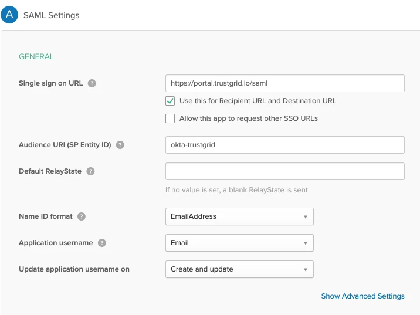

In Okta, switch to the Classic UI to be able to configure SAML applications.

Further Information on configuring SAML Application in Okta Classic UI: https://developer.okta.com/standards/SAML/setting_up_a_saml_application_in_okta/

Create an Application, then select `Web` and `SAML 2.0`.

When configuring SAML, enter the [Trustgrid Portal](https://portal.trustgrid.io/saml) and select `EmailAddress` for Name ID format and `Email` for Application username.

Complete the following survey questions and then download the IDP Metadata XML File by clicking on Identity Provider Metadata link. This will open up the xml file as shown below. Save this XML file and provide it to Trustgrid Support. 

Additionally you will also need to provide a subdomain that will be used as the login URL only for SAML users. For example the subdomain must be subdomain.trustgrid.io. Any Okta Users going to https://subdomain.trustgrid.io will be directed to the Okta Login Page and authenticate with their Okta credentials. Once authenticated successfully they will be logged into the Trustgrid Portal.  Note that if for any reason SAML authentication is failing you may always fall back to the Trustgrid portal local authentication by navigating to https://portal.trustgrid.io and using your Trustgrid portal user credentials.  All users that are going to use Okta to login to the Trustgrid portal will need to be associated with the Trustgrid Okta SAML Application. 

Reference for assigning users to Okta SAML Application: https://developer.okta.com/standards/SAML/setting_up_a_saml_application_in_okta

Once both the XML file and subdomain have been received by Trustgrid Support it will be configured in the Trustgrid Portal. 

#### Adding SAML Users
After enabling SAML you can add users following the process below:
1. In Okta, add the user either to the Trustgrid application directly or to a group that includes access to the Trustgrid application
2. In the Trustgrid portal,  invite the Trustgrid user using their primary email address in Okta
3. The users should receive an email with a link that directs them to https://subdomain.trustgrid.io  but they can navigate there directly. Subdomain will be whatever was provided to Trustgrid support as they enabled SAML.  

