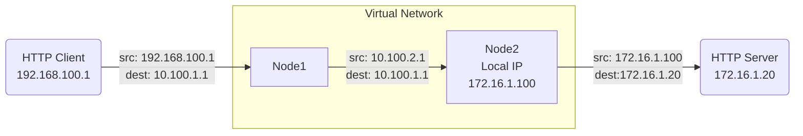

{}
Flow logs are a records of for network traffic that passes through a node. They can be used to troubleshoot connectivity issues, or to monitor traffic patterns. 
{}

## What are flow logs?
Flow logs are records containing metadata about each network traffic flow, or conversation, from the initial connection (e.g. the first SYN packet for TCP) to the closing of the connection (e.g. FIN or RST packets for TCP). Flow logs **do not contain any payload data** for the flow which makes them much smaller and more secure than a full packet capture of the same flow.

Flow logs can be used for troubleshooting by:
 - Verifying that both the expected source and destination node have the appropriate logs.
 - That any [NATs](#nat-impact-on-source-and-destination-fields) are applying as expected.
 - That the expected number of flows or sent/received byte are being passed. 
 - TCP Flags can be used to confirm a successful connection is being made. For example:
   - A TCP Flow with only a SYN flag is never completing the TCP Handshake process indicating an issue, such as a firewall or routing configuration problem, preventing the destination IP from either receiving packets or replying successfully
   - A TCP Flow with only a SYN & RST flag indicates something in the path is actively resetting the connection attempt. This could be a firewall or an application IP restriction.

### Flow Log Data
Below are the potential fields of a single flow log.



The time the flow started


The time the flow ended


The protocol of the traffic TCP, UDP, ICMP


The node that initiated the flow


The IP address through which the node initiated the flow


The port through which the node initiated the flow


The node that received the flow


The IP address to which traffic was sent


The port to which traffic was sent


Bytes received at the source node


Bytes sent from the source node


TCP Flags set during the flow:

- SYN - sync packet
- PSH - push packet
- ACK - ack packet
- URG - urgent packet
- FIN - finish packet
- RST - reset packet

TCP Flags are only available for **TCP** flows that traverse the layer 3 VPN function. ICMP and UDP traffic, [Layer 4 services]() and [VPN Port Forwards]() will not have this data.





### NAT Impact on Source and Destination Fields
When [NATs]() are applied to a flow they will influence the source/destination IP and port values.  

Consider this flow:

Node1 would report the flow before any NATs were applied

| Source IP | Destination IP |
|-----------|----------------|
| 192.168.100.1 | 10.100.1.1 |

Node2 would report the flow after the NATs on Node1 were applied (changing the source 10.100.2.1) and the NATs on Node2 were applied (changing the source to 172.16.1.100 and the destination to 172.16.1.20)

| Source IP | Destination IP |
|-----------|----------------|
| 192.168.100.1 | 10.100.1.1 | 

 For simplicity sake ports were excluded. Destination ports will not be changed by NATs.  Source ports would also be maintained for any 1:1 NAT, but would change if a many:1 (or overload) NAT was applied to the flow. 

## Viewing Flow Logs
Flow logs are visible at an organization level by navigating to [Operations > Flow Logs](). This will show you the most recent 1000 flows over the last two hours for the **all** nodes in the organization.

To view Flow Logs only for traffic through a specific node, navigate to that node and go to [History > Flow Logs](). This will show you the most recent 1000 flows over the last two hours for the **currently selected** node.



### Advanced Search

Flow logs can be filtered by any of the fields listed above. To filter by a field, click the `Advanced Search` button at the top right of the flow logs table.

In addition, the ordering can be changed so that oldest flows (or flows closest to the time range specified) can be shown first. There is a limit of 10,000 flows returned per search.

