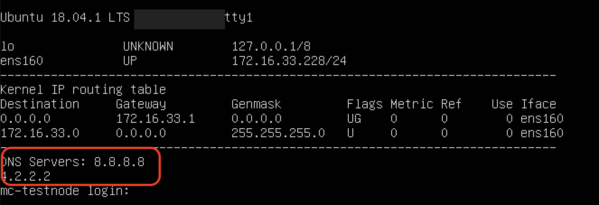
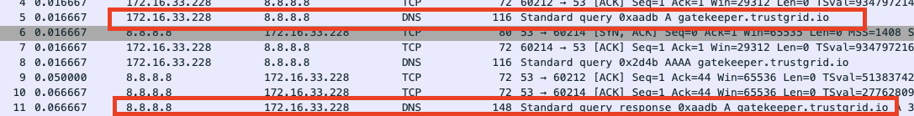

## Symptoms

- Node does not connect to the Portal
- Packet captures show repeated DNS queries for gatekeeper.trustgrid.io but no response

## Cause

- DNS servers configured on edge node are not accessible
- A firewall is blocking TCP/UDP port 53 between the edge node and the configured DNS
- DNS servers configured on edge node cannot resolve public DNS entries for the trustgrid.io domain

## Troubleshooting Steps

- Determine the configured DNS Servers - Connecting a monitor to the node will display the current IP configuration including the DNS Servers as shown below: 
- (If possible) Capture traffic between the edge node and the internet and confirm you see both a DNS query (usually for gatekeeper.trustgrid.io) **AND** response 

## Resolution

- Ensure the edge node can make TCP/UDP connection on port 53 to the configured DNS server
- If using private DNS server ensure they have forwarders configured that can resolve trustgrid.io DNS records
- If configured DNS servers are incorrect the node will need to be manually reconfigured. Contact Trustgrid Support for assistance
