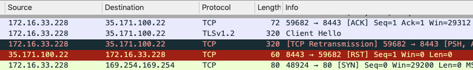
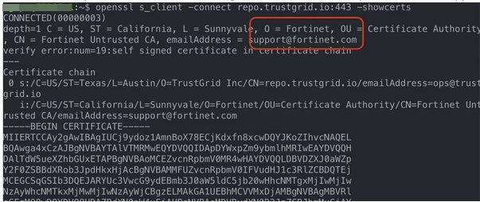
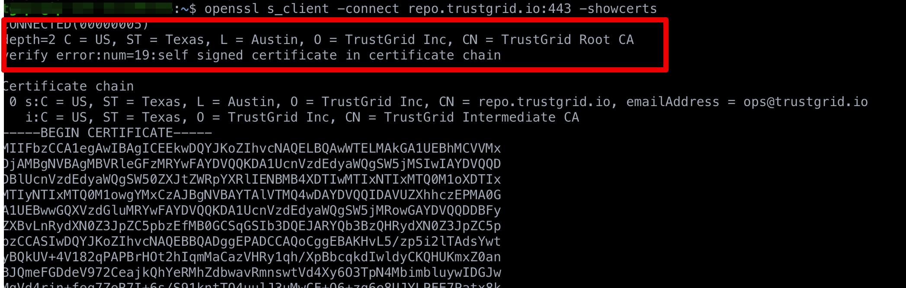

{}
Products that alter SSL/TLS certificate chains will prevent the node from functioning normally.
{}

## Symptoms

- Node will not connect - This will occur if the SSL/TLS chain is altered on port 8443
- Node will not update - This will occur if the SSL/TLS chain is altered on port 443
- Packet captures will show something like the below repeating:
- - TLS “Client Hello”
- - Server (Trustgrid IP) will send a reset (RST) 

## Cause

The integrity of communication is a critical feature of Trustgrid’s network solution. Any product that alters the SSL certificate chain will prevent the node from functioning normally.

Typically this is caused by a security appliance (Next Generation Firewall or Web Proxy) doing some form of SSL Decryption (e.g. DPI-SSL, HTTPS inspection)

## Verification

To verify this is indeed occurring you can run the below command from the Trustgrid terminal:

```bash
openssl s_client -connect repo.trustgrid.io:443 -showcerts
```

This example is testing connectivity to the Trustgrid repository used for updates. You can replace `repo.trustgrid.io:443` with `gatekeeper.trustgrid.io:8443` to test connectivity to a Trustgrid service over 8443.

After running you will need to scroll back to the top to see the first certificate in the chain

If the certificate chain is being altered you will see something like the below where Trustgrid is not the first entry:



The correct certiticate chain should look like:



## Resolution

- Traffic on ports 443 and 8443 between the Trustgrid node and the [Trustgrid public IPs]() and/or \*.trustgrid.io must be excluded from any SSL/TLS decryption/inspection
- After excluding the traffic, restart the edge node
