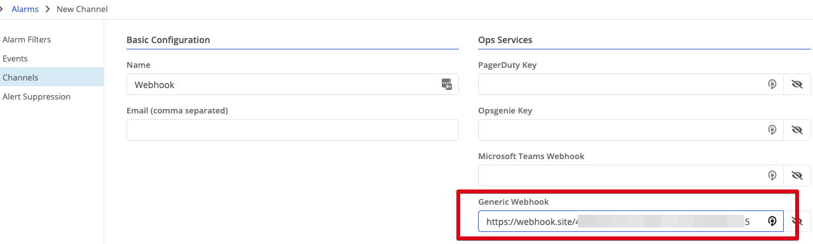

## Tag Improvements
Two major improvements regarding tags.  

### Cluster Members Inherit Tags
Previously you had to set tags at the node and cluster level which required a lot of duplicate effort.  Now when you configure tags at the cluster level the member nodes inherit this tag.  

### Tags Searchable in the Nodes Table
With this release if you add a tag as a column to the nodes table, you can then search the table for matching values.

## Nodes Table Improvements
Two new columns can be added to the nodes table:

### Virtual Management IP Column
You can now see from the table the virtual management IP assigned to each node. If you have multiple virtual networks you will have the option to select each network as a column. These columns have the prefix `MGMT IP:`.

### Device Type Column
You can now see what type of device, physical or virtual, is running the node software.  

## Generic Webhook Support as an Alert Channel
This version adds the ability to publish alerts to a channel utilizing a generic webhook. This should allow integration with additional systems beyond the built-in channels Trustgrid supports.

To utilize either edit an existing channel or create a new one and populate the Generic Webhook section. 

## Provisioning Improvements
There have been several changes to the Provisioning (formerly Orders) section of the Portal including:

* Due Dates for Orders
* Support for specific device models (as opposed to just hardware vs virtual)

