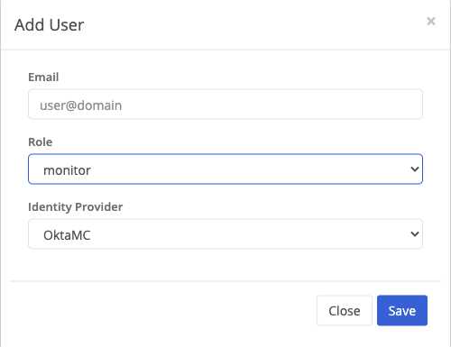
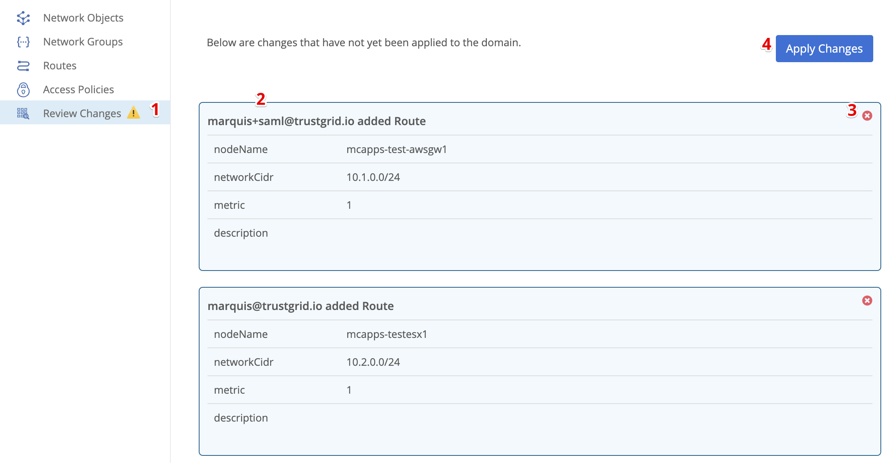
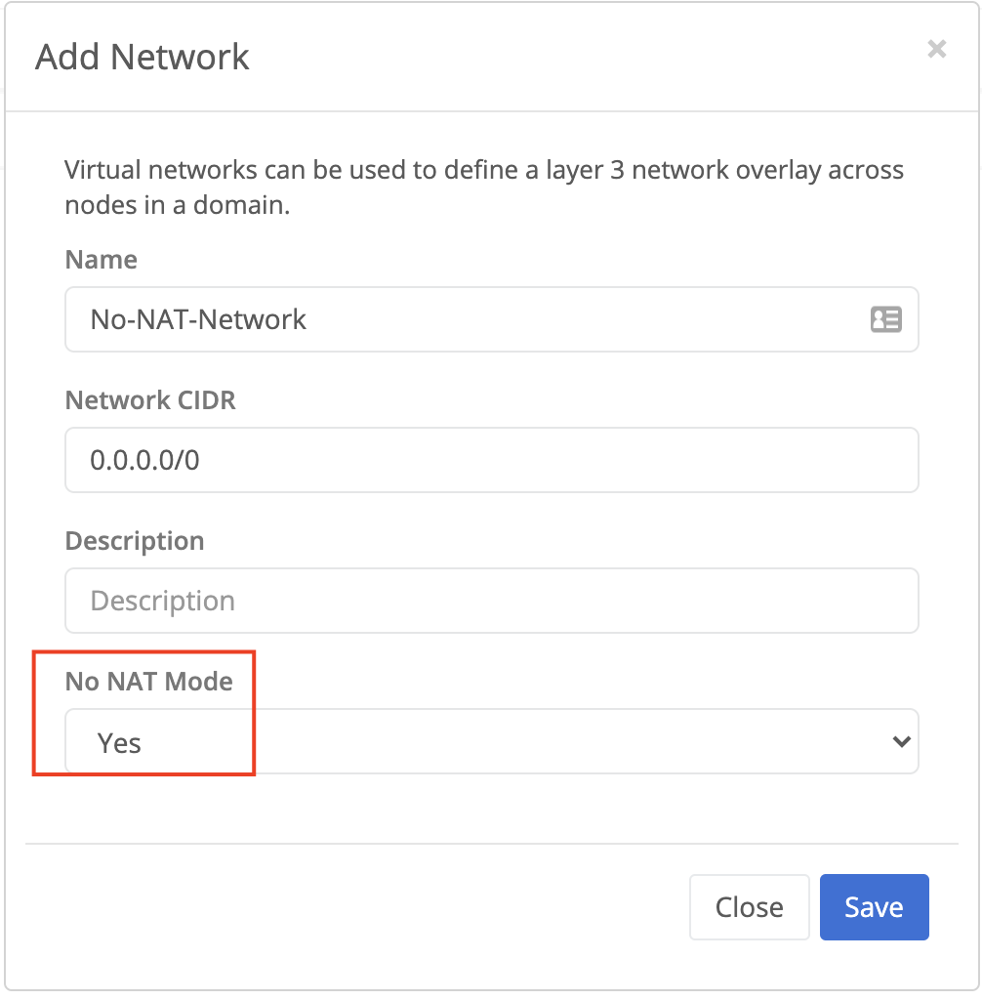
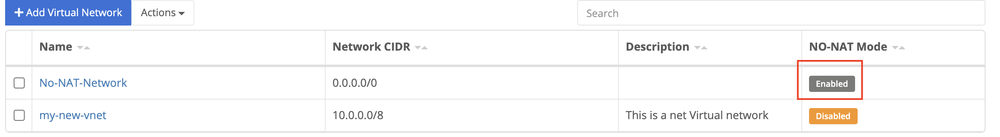
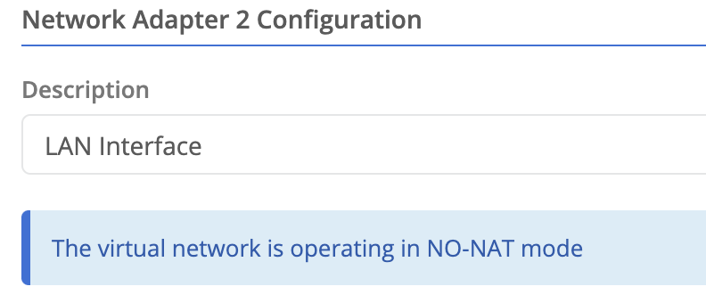
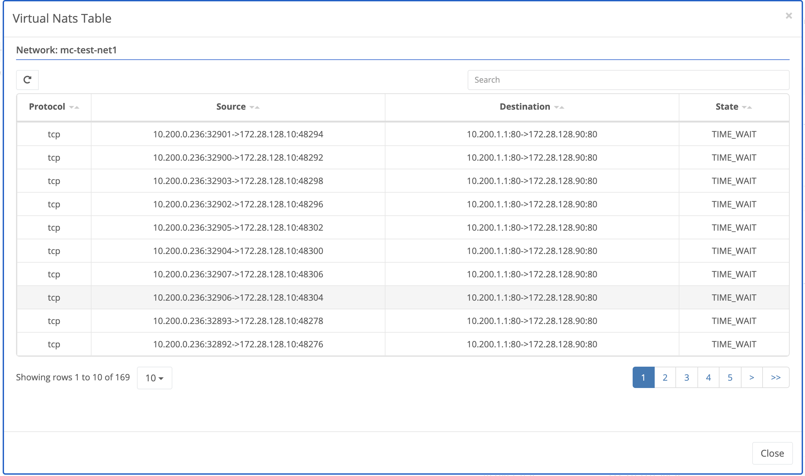
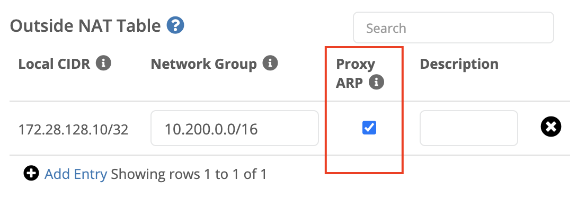

## Improved Identity Provider Integration

Trustgrid has supported SAML integration to manage portal access for some time. As we began supporting additional services, such as Remote Access applications, more flexibility was needed. 

## OpenID Support
OpenID is a newer standard for managing communication between an application and an Identity Provider (IdP).  It offers additional functionality compared to SAML including the ability to simplify integration.  

At this point, Trustgrid supports simplified integration with Google G Suite and Microsoft AzureAD which includes the ability to synchronize groups and group members. Trustgrid will expand this functionality to other IdPs in the future but for now, other OpenID compatible IdPs can be integrated using a more generic OpenID setup process. 

## SAML Self-Service
Trustgrid will continue to support SAML integration. Previously the setup process required the Trustgrid Support Team to complete the configuration, but now this is available to Administrators.

## Add Users Instead of Inviting Them
**Previously**, adding new users to the Trustgrid portal was a bit clunky when using the SAML integration. To add a user you would:

1. Invite the user. This would generate an email which the user didn’t really need. 

1. The user would then need to successfully authenticate via the configured IdP. 

1. You could then adjust the user's role to reflect the appropriate permissions.

**Now**, when an IdP is configured there is a simplified process:

1. From the User Management panel click “Add User”

1. From a single prompt, you can enter the user’s email address (matching what is configured in the Identify Provider), set their Role, and select the correct Identity Provider (if there is more than one).

	

The option to Invite Users is still available under Actions if you need to create users in the Trustgrid native IdP. 

## Domain Improvements
In addition to the changes outlined below, it is worth noting that Domains have been moved under the Management section of the navigation bar. 

### Review Changes
Trustgrid Domains encompass configuration settings that impact many nodes and clusters, such as Virtual Network Routes.  The impacts of changes here can have a wide effect and it is not uncommon for multiple members of a team to be working in this context at the same time without knowing it.  

To address this Trustgrid has updated the user interface to reduce the risk of improper or conflicting changes. After a change is made within a domain it is not immediately applied.  

1. Instead, a warning icon will be added to the Review Changes panel.  Navigating to this panel will display all changes that are waiting to be applied.

1. The changes will include the user making the change. If more than one user has made changes they can confirm with that user if they are ready for that change to go into effect. 

1. Optionally, if they determine one of the changes should not be applied it can be removed by clicking the red X.   Be aware that if this is done the change would have to be recreated and reviewed to add later.

1. Once the user has confirmed the changes look correct they can click Apply Changes. You will be prompted to confirm and then the changes will be pushed out to nodes in the domain.

### Improved Virtual Network Routes Table
The Virtual Network Routes table has been significantly reworked in this release. 

The biggest improvement is in the Destination selection method.  The old interface required selecting from a long list of all nodes and clusters in the domains which became unmanageable as the number of these increased.  Additionally, there was no distinguishing between nodes and clusters beyond the name. 

Now when the Destination field is selected you are given a list (typeahead filtered) that now has a prefix of Cluster or Node to clearly identify the destination type.

Additionally, the Save and Add Routes buttons have been moved to the top of the table to reduce the need to scroll down as you work.  

### No-NAT Virtual Networks
Making Network Address Translation (NAT) easier to manage and scale has been a primary use case for Trustgrid.  However, there are some situations where altering the IP addresses is unnecessary and even undesirable.  

To address this we have added the ability to create a Virtual Network that will perform no address translation by default.  This should greatly increase the ease of configuring such networks. 

When adding a new Virtual Network set the “No NAT Mode” to Yes.  For a Network CIDR just enter 0.0.0.0/0, this field will be made optional in a later release.

After creation, you will see that NO-NAT Mode is enabled in the table.

Whenever this network is attached to a Node or Cluster interface you will see a notice like the below.

## VPN Improvements
The VPN interface in the portal has been reworked in ways we hope will simplify the experience when configuring and managing.

### Feature Navigation Panels

The legacy VPN page frequently required significant scrolling to get to the most relevant section.  The new interface breaks these sections into multiple panels.

Since Address Translation is the most commonly used section it is automatically selected when you navigate into the VPN context.

### Improved Multiple Virtual Network Support
Trustgrid has supported Nodes and Clusters being attached to multiple Virtual Networks but the user experience interacting with them was cumbersome.  For example, in a number of places, you had to select from a list of all the available virtual networks, even if they weren’t attached. This experience has been greatly improved.

### VPN Virtual Networks Table
If the Node or Cluster is already attached to a single Virtual Network this will be selected automatically when you select the VPN navigation link.  However, if you have multiple networks you will be presented with a table of only the attached Virtual Networks. 

The Actions dropdown of this table will enable you to Attach additional Virtual Networks or Detach the current Virtual Networks. 

### Overview Virtual Network Graph

Previously the Overview Virtual Network graph listed all Virtual Networks within a domain. Now it will only show attached networks.
 
## VPN Toolbar 

Once you have navigated to the VPN context of a node and selected a Virtual Network you will see a bar like the below at the top of the page.  The bar provides important data about the Virtual Network including the node’s Virtual Management IP (and the ability to edit it). 

Clicking the Tools button on the right of the bar brings up a menu of both Virtual Network and Interface tools. Users no longer have to switch between tabs to access these different toolsets. 

## New Virtual Translation Table Interface
The View Virtual Translation Table shows active NATs similar to a `show connections` command from legacy solutions.  Previously running this tool produced raw console output that could be challenging to work with when there were large numbers of active connections.

The new version of the tools creates a paginated table that is easily searchable and can be refreshed without needing to return to the Tools section. 

## ProxyARP Option for Outside NATs
Previously the Trustgrid node would ARP on the local network for any IP contained in the Local CIDR of an outside NAT.  For example, if your Outside NAT Local CIDR was for 192.168.1.0/24, the node would respond to ARP requests for any IP in that network (192.168.1.1 - .254).  

This is still the default behavior, but there is now an option to disable this functionality when configuring Outside NATs. 

