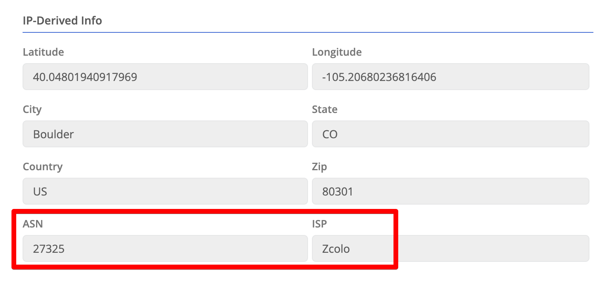

## Resource-Scoped Permission Policies

The [May 2022 release]() enabled the creation of more granular permissions policies. With this release we’ve added the ability to grant permissions to specific [node]() or [cluster]() resources.  This enables you to limit a user to only see specific devices with very limited permissions. 

Polices now have a `Resources` section. This can be populated with a list of Trustgrid Resource Names (TGRN) to limit where the defined permissions are applied. See the documentation on [Resource-Scoped Polices]() for more info. 

## Monitor Network Hops

Trustgrid has add a troubleshooting feature to collect traceroute like data on a regular basis.  When enabled a node will collect 3 samples a minute and store the data in the cloud. This data will assist in determining the source of packet loss or high latency between devices.   See [Monitoring Network Hops to Peers]() to learn more.

## Show ISP and ASN for Public IP

Trustgrid now uses our IP geolocation database provider to supply the internet service provider (ISP) and autonomous system number (ASN) associated with the public IP of nodes.  This info is visible under History → Location, listed under the IP-Derived Info panel.

It should be noted the accuracy of this information varies between ISPs

## Identity Provider (IdP) Logins in Authentication Audits

Previously, the logs under the Operations → Authentication Audits only displayed logins using the Trustgrid native authentication provider.  If you were using an IdP you would need to review the providers logs to see when users logged in.  

With this release we now display IdP portal logins the same way native logins are reported.

